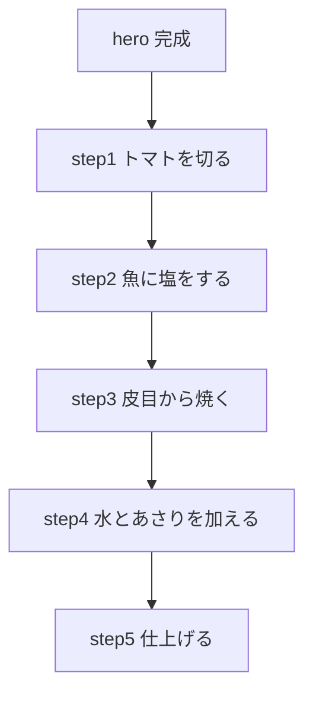

# draft アクアパッツァ

## レシピID案

```text
acqua_pazza
```

## 料理名

アクアパッツァ

## 概要

白身魚をトマト、あさり、水で煮る。

最後にセミドライトマトとあさりを戻す。

エキストラバージンオイルとパセリで仕上げる。

## 読み取り元

```text
_test-data/Image_20260619_131020_044.jpeg
```

## 食べる理由

- 魚をさっぱり食べたい日に合う。
- あさりとトマトの旨みで、白身魚を主役にできる。
- ワインや軽い酒にも合わせやすい。

## 材料

### メイン

| 材料 | 分量 |
|---|---|
| 白身魚 | 要確認 |
| 塩 | 適量 |
| トマト | 要確認 |
| あさり | 要確認 |
| 水 | 要確認 |
| セミドライトマト | 要確認 |
| エキストラバージンオイル | 要確認 |
| パセリ | 適量 |

### 読み取りメモ

- 「プチトマトを半分にカット」と読める。
- 「まんべんなく塩をして 192度で」と読める。
- 192度は温度として要確認。
- 「タイの切り身に塩で下味」と読める。
- 「多めのオリーブオイルで皮目からしっかり焼く」と読める。
- 「押さえてそりかえらないようにしっかりこげ目をつけて焼く」と読める。
- 「水を加える」と読める。
- 「多めのあさりを入れる」と読める。
- 「ダシがでたらあさりを一度とり出す」と読める。
- 「水の分量はできとう 足らなければ足す」と読める。
- 「最後にセミドライトマトで旨み出す + あさりもどす」と読める。
- 「エキストラバージンオイルを多めに入れて香りづけ」と読める。
- 「パセリをふりかけて完成」と読める。

## 作り方

### 1. トマトを切る

プチトマトを半分に切る。

要確認: セミドライトマトを使う場合、最初から入れるか最後に入れるか。

### 2. 魚に下味をつける

タイの切り身に塩をして下味をつける。

要確認: 魚はタイで確定か。

### 3. 魚を焼く

多めのオリーブオイルで皮目から焼く。

反り返らないように押さえる。

皮目にしっかり焼き色をつける。

### 4. 水とあさりを加える

水を加える。

多めのあさりを入れる。

あさりの出汁を出す。

要確認: 水の分量。

### 5. あさりを一度取り出す

出汁が出たら、あさりを一度取り出す。

加熱しすぎを防ぐ。

### 6. 旨みを足して仕上げる

セミドライトマトを加えて旨みを出す。

あさりを戻す。

エキストラバージンオイルを多めに入れて香りをつける。

パセリをふりかけて完成。

## 注意点

- 魚は皮目から焼く。
- 反り返らないように押さえる。
- あさりは出汁が出たら一度取り出す。
- 水は足りなければ足す。
- 仕上げのエキストラバージンオイルは香りづけとして使う。

## 想定する気分タグ

```text
light
drink
```

## 時間

```text
25分
```

要確認: 下処理と砂抜き済みあさりを使う前提。

## 難易度

```text
★★★☆☆
```

## カロリー仮置き

```text
520 kcal
```

要確認: 魚の量とオイル量で変動する。

## PFC仮置き

| 項目 | 仮置き |
|---|---:|
| P | 45g |
| F | 28g |
| C | 12g |

## 画像化したい場面



| 種別 | 内容 |
|---|---|
| hero | 白身魚、あさり、トマト、パセリが見える完成皿 |
| step 1 | プチトマトを半分に切る |
| step 2 | タイの切り身に塩をする |
| step 3 | フライパンで皮目から焼く |
| step 4 | 水とあさりを加えて煮る |
| step 5 | セミドライトマト、あさり、オイル、パセリで仕上げる |

## 要確認

- 魚はタイで確定か。
- 「192度」は正しい読み取りか。
- 水の分量。
- あさりの分量。
- トマトとセミドライトマトの使い分け。
- セミドライトマトを入れるタイミング。
