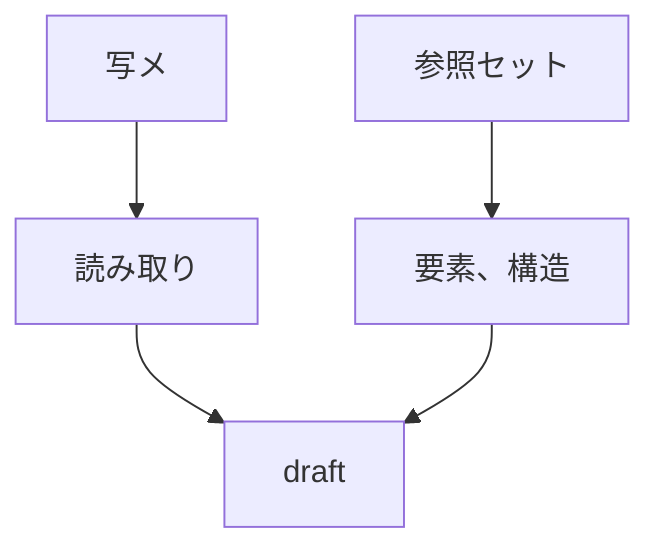
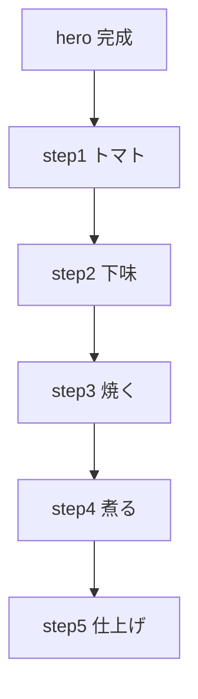

# draft アクアパッツァ

## レシピID案

```text
acqua_pazza
```

## 料理名

アクアパッツァ

## 読み取り元

```text
_test-data/Image_20260619_131020_044.jpeg
```

## 参照

```text
_create-recipe/reference-set.md
```



## hero案

| 要素 | 内容 |
|---|---|
| eyebrow | あさりとトマトの旨みで白身魚をふっくら |
| title | アクアパッツァ |
| scene | 軽く飲みたい夜に、魚で満たす |

## intro案

白身魚を皮目から焼く。

あさりの出汁とトマトの酸味で煮る。

仕上げのオイルとパセリで香りを立てる、軽いのに満足できる一皿です。

## 基本情報案

| 項目 | 内容 |
|---|---|
| 時間 | 25分 |
| 難易度 | ★★★☆☆ |
| カロリー | 520 kcal |

要確認: あさりの砂抜き済みを前提にしている。

## PFC仮置き

| 項目 | 仮置き |
|---|---:|
| P | 45g |
| F | 28g |
| C | 12g |

要確認: 魚の量とオイル量で変動する。

## 食べる理由

### ハマる人

- 魚をさっぱり食べたい人。
- あさりとトマトの旨みで満足したい人。
- 油っこすぎない酒のつまみが欲しい人。

### おすすめのシーン

- 白ワインや軽い酒と合わせたい夜。
- 肉より魚の気分の日。
- さっぱりしているけど、ちゃんと満たされたい日。

## 材料

### メイン

| 材料 | 分量 |
|---|---|
| タイの切り身 | 要確認 |
| 塩 | 適量 |
| プチトマト | 要確認 |
| あさり | 多め |
| 水 | 要確認 |

### 仕上げ

| 材料 | 分量 |
|---|---|
| セミドライトマト | 要確認 |
| エキストラバージンオリーブオイル | 多め |
| パセリ | 適量 |

### 読み取りメモ

- 「プチトマトを半分にカット」と読める。
- 「まんべんなく塩をして 192度で」と読める。
- 「タイの切り身に塩で下味」と読める。
- 「多めのオリーブオイルで皮目からしっかり焼く」と読める。
- 「押さえてそりかえらないようにしっかりこげ目をつけて焼く」と読める。
- 「水を加える」と読める。
- 「多めのあさりを入れる」と読める。
- 「ダシがでたらあさりを一度とり出す」と読める。
- 「水の分量はできとう 足らなければ足す」と読める。
- 「最後にセミドライトマトで旨み出す + あさりもどす」と読める。
- 「エキストラバージンオイルを多めに入れて香りづけ」と読める。
- 「パセリをふりかけて完成」と読める。

## 作り方

### 01. トマト

プチトマトを半分に切る。

セミドライトマトは仕上げ用に分けておく。

要確認: セミドライトマトを最初から入れるか、最後だけにするか。

### 02. 下味

タイの切り身に塩をまんべんなくふる。

要確認: 魚はタイで確定か。

要確認: 「192度」はオーブン温度か、読み取り違いか。

### 03. 焼く

多めのオリーブオイルを入れる。

魚を皮目から焼く。

反り返らないように押さえる。

皮目にしっかり焦げ目をつける。

### 04. 煮る

水を加える。

あさりを多めに入れる。

あさりの出汁が出るまで煮る。

出汁が出たら、あさりを一度取り出す。

要確認: 水の分量。

### 05. 仕上げ

セミドライトマトで旨みを足す。

取り出したあさりを戻す。

エキストラバージンオリーブオイルを多めに入れて香りをつける。

パセリをふりかけて完成。

## 注意点

- 魚は皮目から焼く。
- 反り返らないように押さえる。
- 皮目にしっかり焦げ目をつける。
- あさりは出汁が出たら一度取り出す。
- 水は足りなければ足す。
- 仕上げのオイルは香りづけとして使う。

## ここだけ注意案

### 皮目

押さえながら焼くと反り返りにくい。

皮目に焦げ目がつくと香ばしくなる。

### あさり

出汁が出たら一度取り出す。

火を入れすぎると身が硬くなる。

## 店長の独り言案

白身魚は、あさりの出汁を吸わせたら勝ち。

- 水の量は、足りなければ足せばいい。
- 皮目だけはちゃんと焼く。
- 最後のオイルとパセリで、急に店っぽくなる。

## 想定する気分タグ

```text
light
drink
```

## 一覧表示案

| 項目 | 内容 |
|---|---|
| title | アクアパッツァ |
| file | detail.html?id=acqua_pazza |
| image | ./assets/images/acqua_pazza_hero.webp |
| scene | 軽く飲みたい夜に、魚で満たす |
| time | 25分 |
| difficulty | ★★★☆☆ |
| calories | 520 kcal |
| moods | light / drink |

## 画像化したい場面



| 種別 | 内容 |
|---|---|
| hero | 白身魚、あさり、トマト、パセリが見える完成皿 |
| step 1 | プチトマトを半分に切る |
| step 2 | タイの切り身に塩をふる |
| step 3 | フライパンで皮目から焼く |
| step 4 | 水とあさりを加えて煮る |
| step 5 | セミドライトマト、あさり、オイル、パセリで仕上げる |

## 要確認

- 魚はタイで確定か。
- 「192度」は正しい読み取りか。
- 水の分量。
- あさりの分量。
- プチトマトの分量。
- セミドライトマトの分量。
- セミドライトマトを入れるタイミング。
- あさりは砂抜き済み前提で良いか。
