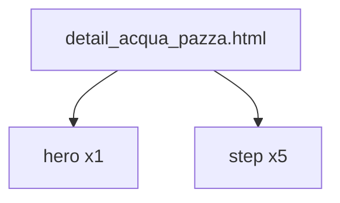

# 画像生成プロンプト アクアパッツァ

## 目的

アクアパッツァ用のhero画像とstep画像を作成する。

画像ファイルはまだ作成しない。



## 入力

```text
partials/details/detail_acqua_pazza.html
```

## 参照

```text
_create-recipe/reference-set.md
```

## 共通ルール

- 明るい自然光の料理写真にする。
- 文字入り画像にしない。
- 暗すぎる写真にしない。
- 料理と工程が分かる構図にする。
- Webサイトのレシピ画像として使いやすい横長構図にする。
- 皿、フライパン、手元は清潔に見せる。
- 過度な湯気や演出を避ける。
- 画像内に人物の顔を入れない。

## 出力画像

| 種別 | ファイル名 | 内容 |
|---|---|---|
| hero | `acqua_pazza_hero.webp` | 完成したアクアパッツァ |
| step 1 | `acqua_pazza_step_1_tomato.webp` | プチトマトを半分に切る |
| step 2 | `acqua_pazza_step_2_season.webp` | タイの切り身に塩をふる |
| step 3 | `acqua_pazza_step_3_sear.webp` | 白身魚を皮目から焼く |
| step 4 | `acqua_pazza_step_4_simmer.webp` | 水とあさりを加えて煮る |
| step 5 | `acqua_pazza_step_5_finish.webp` | セミドライトマトとオイルで仕上げる |

## hero

### ファイル名

```text
acqua_pazza_hero.webp
```

### プロンプト

```text
明るい自然光の料理写真。
完成したアクアパッツァ。
白身魚の切り身、あさり、プチトマト、セミドライトマト、パセリが見える。
浅い白い皿に盛り付ける。
魚はふっくらしていて、皮目に軽い焼き色がある。
スープにオリーブオイルのつやがある。
横長構図。
Webレシピサイトのメイン画像。
文字なし。
人物なし。
暗い背景にしない。
```

## step 1

### ファイル名

```text
acqua_pazza_step_1_tomato.webp
```

### プロンプト

```text
明るい自然光の料理工程写真。
まな板の上でプチトマトを半分に切っている。
赤いプチトマトが数個並んでいる。
包丁と手元だけを写す。
清潔なキッチンの作業台。
横長構図。
Webレシピサイトの手順画像。
文字なし。
人物の顔なし。
暗い背景にしない。
```

## step 2

### ファイル名

```text
acqua_pazza_step_2_season.webp
```

### プロンプト

```text
明るい自然光の料理工程写真。
タイの切り身に塩をまんべんなくふっている。
白身魚の切り身をバットか皿に置く。
魚の表面が分かる寄りの構図。
手元だけを写す。
横長構図。
Webレシピサイトの手順画像。
文字なし。
人物の顔なし。
暗い背景にしない。
```

## step 3

### ファイル名

```text
acqua_pazza_step_3_sear.webp
```

### プロンプト

```text
明るい自然光の料理工程写真。
フライパンで白身魚を皮目から焼いている。
多めのオリーブオイルがあり、皮目に焼き色がつき始めている。
魚を軽く押さえて反り返りを防いでいる手元。
フライパン中心の構図。
横長構図。
Webレシピサイトの手順画像。
文字なし。
人物の顔なし。
暗い背景にしない。
```

## step 4

### ファイル名

```text
acqua_pazza_step_4_simmer.webp
```

### プロンプト

```text
明るい自然光の料理工程写真。
フライパンに白身魚、水、あさり、プチトマトが入り、軽く煮えている。
あさりが開き始めている。
スープが少し見える。
具材の位置が分かる斜め上からの構図。
横長構図。
Webレシピサイトの手順画像。
文字なし。
人物なし。
暗い背景にしない。
```

## step 5

### ファイル名

```text
acqua_pazza_step_5_finish.webp
```

### プロンプト

```text
明るい自然光の料理工程写真。
アクアパッツァの仕上げ。
セミドライトマトを加え、あさりを戻し、エキストラバージンオリーブオイルを回しかける。
最後にパセリをふりかける直前または直後。
白身魚、あさり、トマト、オイルのつやが見える。
横長構図。
Webレシピサイトの手順画像。
文字なし。
人物の顔なし。
暗い背景にしない。
```

## 確認

- hero画像が1件ある。
- step画像が5件ある。
- HTML内の画像ファイル名と一致している。
- 文字入り画像になっていない。
- 暗すぎる画像になっていない。
