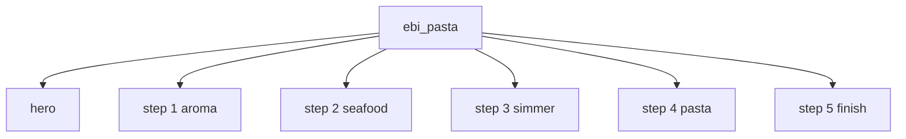

# エビパスタ 画像生成プロンプト

## 共通ルール

- 文字入り画像にしない。
- 暗すぎる写真にしない。
- 明るい自然光で撮る。
- 木のテーブルを使う。
- 和食器または落ち着いた陶器を使う。
- 料理と工程が分かる寄りの構図にする。
- 縦長または正方形で、サイトのheroとstepに使いやすい余白を残す。

## 1. hero

### ファイル名

`assets/images/ebi_pasta_hero.webp`

### プロンプト

明るい自然光の料理写真。木のテーブルの上に、エビの旨みが絡んだトマト寄りのエビパスタを陶器の皿に盛る。殻付きの赤いエビ、あさり、いか、トマトソースをまとったパスタ、刻んだパセリ、仕上げのオリーブオイルの艶を見せる。家庭料理だが少し店っぽい盛り付け。温かい色味。浅い被写界深度。文字なし。

## 2. step 1 aroma

### ファイル名

`assets/images/ebi_pasta_step_1_aroma.webp`

### プロンプト

明るい自然光の調理工程写真。フライパンでエビの殻と頭をオリーブオイル、にんにくと一緒に炒めている場面。赤く色づいた殻、泡立つオイル、薄切りにんにくをはっきり見せる。木のテーブルまたは明るいキッチン台。香りが立っている印象。文字なし。

## 3. step 2 seafood

### ファイル名

`assets/images/ebi_pasta_step_2_seafood.webp`

### プロンプト

明るい自然光の調理工程写真。フライパンでエビといかを軽く炒め、一度取り出す直前の場面。エビはぷりっと赤く、いかは白く艶がある。にんにくとオリーブオイルが全体に絡む。魚介に火を入れすぎない軽い炒め感を出す。清潔なキッチン、寄りの構図。文字なし。

## 4. step 3 simmer

### ファイル名

`assets/images/ebi_pasta_step_3_simmer.webp`

### プロンプト

明るい自然光の調理工程写真。フライパンにあさり、トマトホール、エビの出汁、白ワインが入り、軽く煮込まれている場面。あさりの殻が開き、赤いトマトソースに魚介の旨みが出ている。湯気は控えめ。ソースの色と具材が分かる寄りの構図。文字なし。

## 5. step 4 pasta

### ファイル名

`assets/images/ebi_pasta_step_4_pasta.webp`

### プロンプト

明るい自然光の調理工程写真。少し早めにあげたパスタをフライパンのトマト魚介ソースに入れ、ソースを吸わせながら和えている場面。トングでパスタを持ち上げ、ソースが麺に絡んでいる。エビ出汁の濃い赤橙色、艶のあるオリーブオイルを見せる。文字なし。

## 6. step 5 finish

### ファイル名

`assets/images/ebi_pasta_step_5_finish.webp`

### プロンプト

明るい自然光の完成直前写真。皿に盛ったエビパスタに、炒めたエビといか、あさりを戻し、オリーブオイルを回しかけ、刻んだパセリを散らしている場面。料理の艶、魚介の存在感、パセリの緑をはっきり見せる。木のテーブル、陶器の皿、寄りの構図。文字なし。
