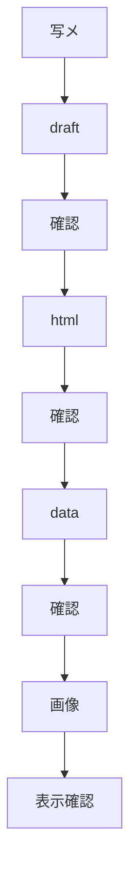
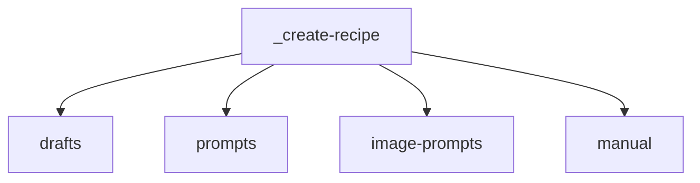
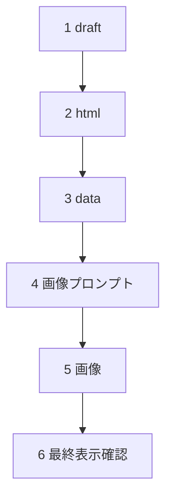

# レシピ更新手順書

## 目的

- 大学ノート写メから新規レシピを追加する。
- 段階ごとに確認する。
- feedbackを反映してから次へ進む。



## 保存先



| 保存先 | 内容 |
|---|---|
| `_create-recipe/drafts/` | 写メから作る原稿 |
| `_create-recipe/prompts/` | 段階別プロンプト |
| `_create-recipe/image-prompts/` | AI画像生成プロンプト |
| `_create-recipe/manual/` | 手順書 |

## 手順

### 手順一覧



| 順 | 手順 | 成果物 |
|---:|---|---|
| 1 | draftを作成する | `_create-recipe/drafts/レシピID.md` |
| 2 | htmlを作成する | `partials/details/detail_レシピID.html` |
| 3 | dataを更新する | `data/recipe-details.json` / `data/recipes.json` |
| 4 | 画像プロンプトを作成する | `_create-recipe/image-prompts/レシピID.md` |
| 5 | 画像を作成する | `assets/images/*.webp` |
| 6 | 最終表示確認する | 表示確認結果 |

---

### 1. draftを作成する

使用プロンプト。

```text
_create-recipe/prompts/01_写メからdraft作成.md
```

実行サンプル。

```text
_create-recipe/prompts/01_写メからdraft作成.md の内容に従って実行して。

入力:
_test-data/Image_20260619_131020_044.jpeg

出力:
_create-recipe/drafts/レシピID.md

今回はdraft作成だけ行う。
HTML作成、data更新、画像作成はまだ行わない。
```

成果物。

```text
_create-recipe/drafts/レシピID.md
```

確認する。

- 料理名
- 材料
- 作り方
- 曖昧な点

---

### 2. htmlを作成する

使用プロンプト。

```text
_create-recipe/prompts/02_draftからhtml作成.md
```

実行サンプル。

```text
_create-recipe/prompts/02_draftからhtml作成.md の内容に従って実行して。

入力:
_create-recipe/drafts/レシピID.md

出力:
partials/details/detail_レシピID.html

今回はHTML作成だけ行う。
data更新、画像作成はまだ行わない。
```

成果物。

```text
partials/details/detail_レシピID.html
```

確認する。

- 見出し
- 材料
- 作り方5ステップ
- 店長の独り言
- 画像パス

注意。

- この時点ではブラウザ確認は行わない。
- data未更新のため、`detail.html?id=レシピID` では確認しない。

---

### 3. dataを更新する

使用プロンプト。

```text
_create-recipe/prompts/03_htmlからdata更新.md
```

実行サンプル。

```text
_create-recipe/prompts/03_htmlからdata更新.md の内容に従って実行して。

入力:
_create-recipe/drafts/レシピID.md
partials/details/detail_レシピID.html

更新対象:
data/recipe-details.json
data/recipes.json

今回はdata更新だけ行う。
画像作成はまだ行わない。
```

成果物。

```text
data/recipe-details.json
data/recipes.json
```

確認する。

- ID重複なし
- JSON構文
- 一覧表示情報
- 詳細HTMLとの接続

接続確認。

```bash
python3 -m http.server 8000
```

```text
http://127.0.0.1:8000/detail.html?id=レシピID
```

ブラウザで確認する。

出力最終にURLを出す。

---

### 4. 画像プロンプトを作成する

使用プロンプト。

```text
_create-recipe/prompts/04_htmlから画像プロンプト作成.md
```

実行サンプル。

```text
_create-recipe/prompts/04_htmlから画像プロンプト作成.md の内容に従って実行して。

入力:
partials/details/detail_レシピID.html

出力:
_create-recipe/image-prompts/レシピID.md

今回は画像プロンプト作成だけ行う。
画像ファイル作成はまだ行わない。
```

成果物。

```text
_create-recipe/image-prompts/レシピID.md
```

確認する。

- hero画像 x1
- step画像 x5
- ファイル名
- 料理内容との一致

---

### 5. 画像を作成する

AI生成で作成する。

使用プロンプト。

```text
_create-recipe/prompts/05_画像作成.md
```

実行サンプル。

```text
_create-recipe/image-prompts/レシピID.md の内容に従って画像を作成して。

入力:
_create-recipe/image-prompts/レシピID.md

出力:
assets/images/レシピID_hero.webp
assets/images/レシピID_step_1_xxx.webp
assets/images/レシピID_step_2_xxx.webp
assets/images/レシピID_step_3_xxx.webp
assets/images/レシピID_step_4_xxx.webp
assets/images/レシピID_step_5_xxx.webp

今回は画像ファイル作成だけ行う。
data更新は行わない。
HTML更新は行わない。
```

保存先。

```text
assets/images/
```

出力ファイル。

```text
レシピID_hero.webp
レシピID_step_1_xxx.webp
レシピID_step_2_xxx.webp
レシピID_step_3_xxx.webp
レシピID_step_4_xxx.webp
レシピID_step_5_xxx.webp
```

確認する。

- hero画像が1件ある。
- step画像が5件ある。
- HTML内の画像ファイル名と一致している。
- data更新は行わない。
- HTML更新は行わない。

例外。

- HTML内の画像ファイル名と実ファイル名が一致しない場合だけ、HTML修正を検討する。

---

### 6. 最終表示確認する

使用プロンプト。

```text
_create-recipe/prompts/06_最終表示確認.md
```

画像込みで確認する。

実行サンプル。

```text
_create-recipe/prompts/06_最終表示確認.md の内容に従って実行して。

入力:
partials/details/detail_レシピID.html
data/recipe-details.json
data/recipes.json
assets/images/

確認URL:
http://127.0.0.1:8000/list.html
http://127.0.0.1:8000/detail.html?id=レシピID

画像込みで最終表示確認を行う。
必要なら修正して。
```

HTTPサーバーを起動する。

```bash
python3 -m http.server 8000
```

確認URL。

```text
http://127.0.0.1:8000/list.html
http://127.0.0.1:8000/detail.html?id=レシピID
```

## 注意

- 既存変更を戻さない。
- 対象ファイルを読んでから編集する。
- HTMLだけでdataを判断しない。
- draftとHTMLを見てdataを更新する。
