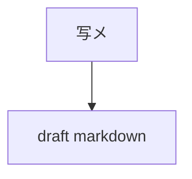

# 01 写メからdraft作成

## 目的

大学ノート写メからレシピ原稿を作る。

## 入力

```text
_test-data/Image_20260619_131020_044.jpeg
```

## 参照

```text
_create-recipe/reference-set.md
```

参照目的。

- 既存レシピの要素、構造を確認する。
- 一覧用項目と気分タグを確認する。
- 全レシピは参照しない。

## 依頼文

```text
大学ノート写メを読み取って、レシピdraftを作成して。

参照:
_create-recipe/reference-set.md

保存先:
_create-recipe/drafts/レシピID.md

ルール:
- まだHTMLは作らない。
- まだdataは更新しない。
- まだ画像は作らない。
- 読み取れない箇所は「要確認」と書く。
- 既存レシピの「要素、構造」を参考にする。
- 文体は必要に応じて既存レシピに寄せる。
- HTML構造にはまだ寄せすぎない。
- 確認しやすいMarkdownにする。

含める内容:
- レシピID案
- 料理名
- 概要
- 食べる理由
- 材料
- 作り方
- 注意点
- 想定する気分タグ
- 時間
- 難易度
- カロリー仮置き
- PFC仮置き
- 画像化したい場面
```

## 出力


