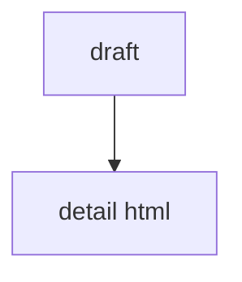

# 02 draftからhtml作成

## 目的

draftから詳細HTMLを作る。

## 入力

```text
_create-recipe/drafts/レシピID.md
```

## 依頼文

```text
draftをもとに、詳細HTMLを作成して。

保存先:
partials/details/detail_レシピID.html

ルール:
- 既存の partials/details/detail_*.html の構造に合わせる。
- まだdataは更新しない。
- まだ画像は作らない。
- 画像パスは assets/images/レシピID_*.webp で仮置きする。
- 作り方は5ステップに整理する。
- CSSは追加しない。

含める内容:
- hero
- intro
- 基本情報
- PFC
- 食べる理由
- 材料
- 作り方5ステップ
- 店長の独り言
```

## 出力


