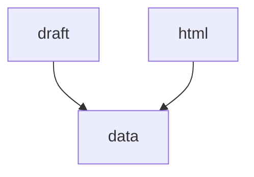

# 03 htmlからdata更新

## 目的

新規レシピをサイトデータへ接続する。

## 入力

```text
_create-recipe/drafts/レシピID.md
partials/details/detail_レシピID.html
data/recipe-details.json
data/recipes.json
```

## 依頼文

```text
draftと詳細HTMLを確認して、data関連を更新して。

更新対象:
data/recipe-details.json
data/recipes.json

ルール:
- draftとHTMLの両方を見る。
- recipe-details.json に id/title/html を追加する。
- recipes.json に一覧用データを追加する。
- moods は既存の4種類から選ぶ。
- JSON構文を確認する。
- まだ画像は作らない。

確認する値:
- title
- file
- image
- scene
- time
- difficulty
- calories
- moods
```

## 出力


