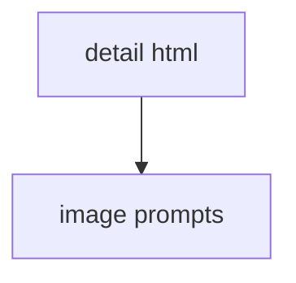

# 04 htmlから画像プロンプト作成

## 目的

詳細HTMLからAI画像生成プロンプトを作る。

## 入力

```text
partials/details/detail_レシピID.html
```

## 参照

```text
_create-recipe/reference-set.md
```

参照目的。

- 既存画像の構図と明るさを確認する。
- hero画像とstep画像の粒度を確認する。
- 全画像は参照しない。

## 依頼文

```text
詳細HTMLをもとに、AI画像生成プロンプトを作成して。

参照:
_create-recipe/reference-set.md

保存先:
_create-recipe/image-prompts/レシピID.md

ルール:
- まだ画像ファイルは作らない。
- hero画像を1件作る。
- step画像を5件作る。
- HTML内の画像パスとファイル名を合わせる。
- 料理の見た目と工程が分かる内容にする。
- 暗すぎる写真にしない。
- 文字入り画像にしない。

含める画像:
- レシピID_hero.webp
- レシピID_step_1_xxx.webp
- レシピID_step_2_xxx.webp
- レシピID_step_3_xxx.webp
- レシピID_step_4_xxx.webp
- レシピID_step_5_xxx.webp
```

## 出力


