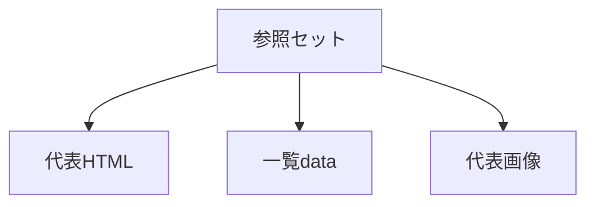

# レシピ作成 参照セット

## 目的

参照ファイルを固定する。

レシピ追加時のブレを減らす。

## 01 draft作成で参照する

| ファイル | 目的 |
|---|---|
| `partials/details/detail_chicken_nanban.html` | 詳細ページの要素を確認する |
| `partials/details/detail_karaage.html` | 工程と注意点の構造を確認する |
| `data/recipes.json` | 一覧用項目と気分タグを確認する |

## 参照ルール

- 全レシピは参照しない。
- 代表ファイルだけ参照する。
- レシピが増えても、この参照セットを優先する。
- draftではHTML構造に寄せすぎない。

## 04 画像プロンプト作成で参照する

| ファイル | 目的 |
|---|---|
| `assets/images/chicken_nanban_hero.webp` | hero画像の構図を確認する |
| `assets/images/chicken_nanban_step_1_marinate.webp` | 下処理工程の見せ方を確認する |
| `assets/images/chicken_nanban_step_5_finish.webp` | 仕上げ工程の見せ方を確認する |
| `assets/images/karaage_hero.webp` | 完成写真の寄り方を確認する |
| `assets/images/karaage_step_3_coat.webp` | 手元工程の見せ方を確認する |
| `assets/images/karaage_step_5_finish.webp` | 完成直前の見せ方を確認する |

## 画像参照ルール

- `assets/images` 全体は参照しない。
- 代表画像だけ参照する。
- 文字入り画像にしない。
- 暗すぎる画像にしない。
- HTML内の画像ファイル名と合わせる。
