# サイトコンテキスト

## 概要

料理サイト「無責任レシピ Chapdaddy」。

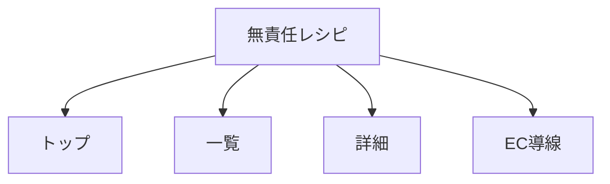

## 作業場所

```text
/Users/Shared/_htdocs/2026/02/P_2026-02-09_cityblend.jpは作成する。Webサイトを。料理Chapdaddyの/htdocs
```

## 出力ルール

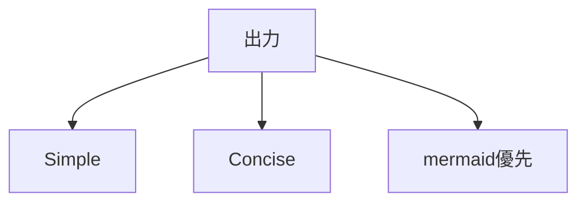

- 一文一義にする。
- 関係性は図で示す。
- 構成は最小限にする。
- Simple / Concise。

## ページ

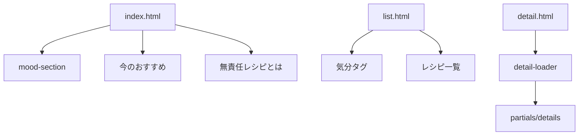

| ページ | 役割 |
|---|---|
| `index.html` | トップページ |
| `list.html` | レシピ一覧 |
| `detail.html?id=...` | レシピ詳細 |

詳細URLは `_docs/サイトマップ.md` を参照する。

## データ

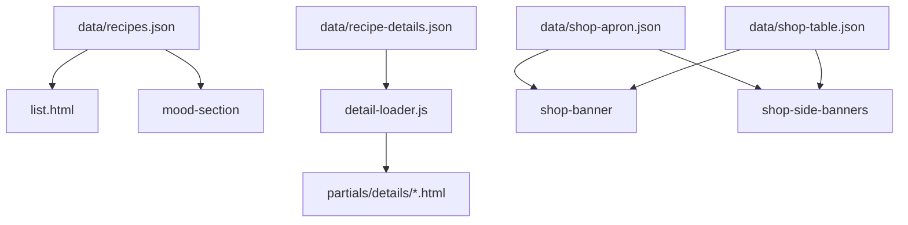

| ファイル | 役割 |
|---|---|
| `data/recipes.json` | 気分タグと一覧レシピ |
| `data/recipe-details.json` | 詳細IDと部分HTMLの対応 |
| `data/shop-apron.json` | APRON系EC導線 |
| `data/shop-table.json` | TABLE系EC導線 |

現在のレシピは7件。

## 実装構成

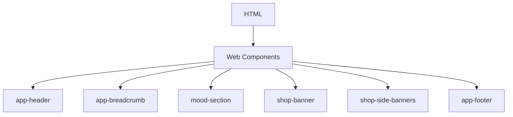

| JS | 役割 |
|---|---|
| `js/app-header.js` | ヘッダー |
| `js/app-breadcrumb.js` | パンくず |
| `js/mood-section.js` | 気分選択 |
| `js/recipe-list.js` | レシピ一覧 |
| `js/detail-loader.js` | 詳細HTML読込 |
| `js/shop-banner.js` | 下部ECカルーセル |
| `js/shop-side-banners.js` | PC左右ECバナー |
| `js/app-footer.js` | フッター |
| `js/main.js` | 詳細ページ補助 |

## 詳細ページ

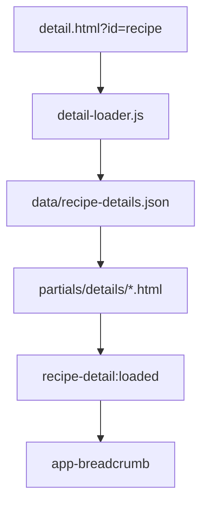

詳細本文は `partials/details` に分離する。

詳細パーツは7件。

## パンくず

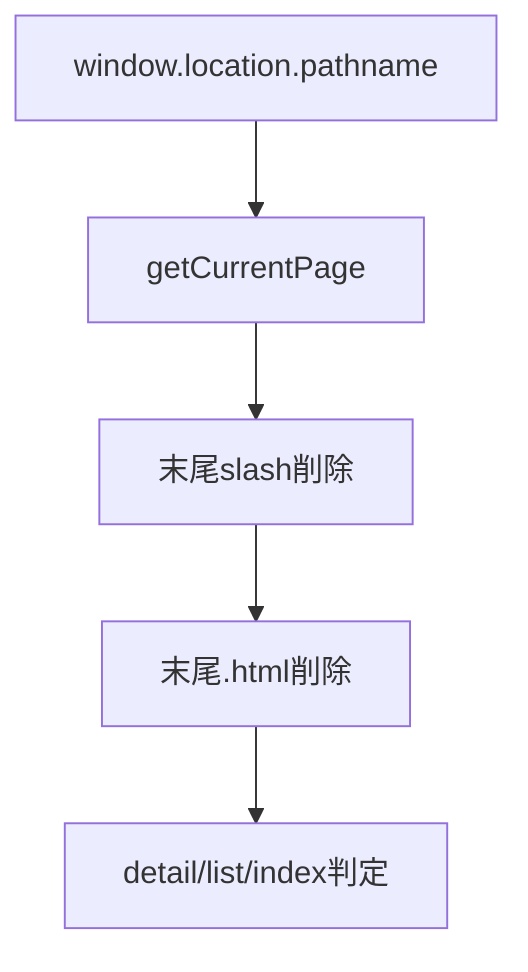

Cloudflare向けに `.html` あり・なしの両方に対応する。

| URL | 判定 |
|---|---|
| `/detail.html` | `detail` |
| `/detail` | `detail` |
| `/list.html` | `list` |
| `/list` | `list` |
| `/` | `index` |

## EC導線

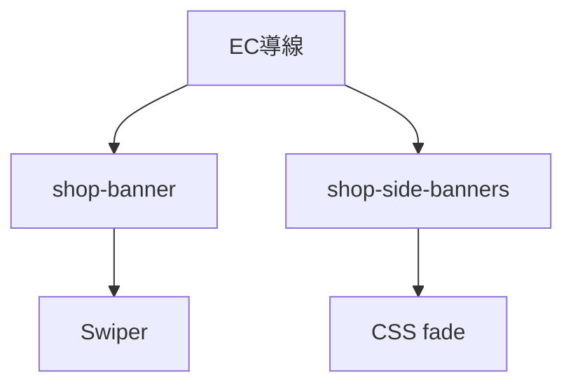

| 部品 | 表示 | 方式 |
|---|---|---|
| `shop-banner` | 下部 | Swiper 12 |
| `shop-side-banners` | PC左右 | CSS animation |

PC左右バナーは左右2列。

各列は上枠・下枠を持つ。

各枠は最大4商品を24秒周期でフェードする。

## ライブラリ・外部依存

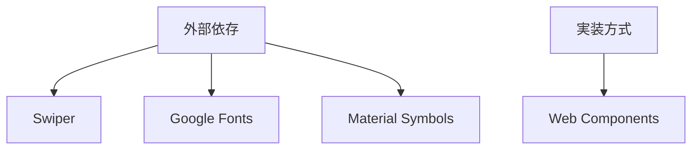

| 名称 | 用途 | 参照 |
|---|---|---|
| Swiper 12 | 下部ECカルーセル | `js/shop-banner.js` |
| Google Fonts | 日本語・英字フォント | `index.html` / `list.html` / `detail.html` |
| Material Symbols | ヘッダー等のアイコン | `index.html` / `list.html` / `detail.html` |
| Web Components | 共通UI部品 | `js/app-*.js` / `js/mood-section.js` / `js/shop-banner.js` |

SwiperはCDNで動的に読み込む。

```text
https://cdn.jsdelivr.net/npm/swiper@12/swiper-bundle.min.css
https://cdn.jsdelivr.net/npm/swiper@12/swiper-bundle.min.js
```

Swiperの参考URLは `_docs/Swiperドキュメン関連.md` を参照する。

## CSS

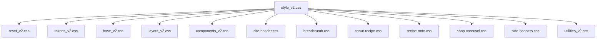

CSS方針は `_docs/設計_共通.md` に従う。

専用CSSは役割別に分ける。

`css/v1.css` は削除済み。

## 画像

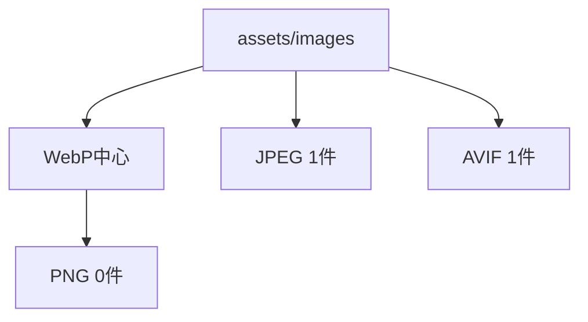

| 種別 | 件数 |
|---|---:|
| WebP | 44 |
| JPEG | 1 |
| AVIF | 1 |
| PNG | 0 |

画像整理結果は `_worklogs/2026-06-18_03-40_未使用画像整理/未使用画像一覧.md` を参照する。

## ドキュメント

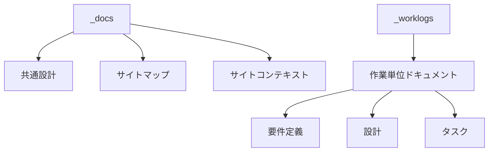

`_docs` は全体資料を保管する。

`_worklogs` は作業単位ドキュメントを保管する。

主な作業単位ドキュメント。

| 日時 | 内容 |
|---|---|
| `2026-06-15_03-51` | 下部ECカルーセル |
| `2026-06-15_05-25` | PC左右ランダムバナー |
| `2026-06-15_14-15` | 気分一覧 |
| `2026-06-15_15-24` | トップ今のおすすめ |
| `2026-06-15_16-06` | 見出しコンポーネント |
| `2026-06-15_17-02` | 詳細ページ共通化 |
| `2026-06-15_18-55` | 気分で選ぶコンポーネント |
| `2026-06-16_01-40` | ヘッダーナビ改修 |
| `2026-06-16_02-55` | パンくずリスト作成 |
| `2026-06-16_03-35` | 無責任レシピとは |
| `2026-06-16_05-17` | メイン画像サイズ統一 |
| `2026-06-16_05-50` | コヤマの独り言 |
| `2026-06-17_22-00` | 詳細ページ作り方Swiper化 |
| `2026-06-17_22-55` | 詳細ページメイン画像フェード |
| `2026-06-18_02-07` | PC左右バナーフェード |
| `2026-06-18_03-02` | Cloudflareパンくず修正 |
| `2026-06-18_03-40` | 未使用画像整理 |

## ローカル確認

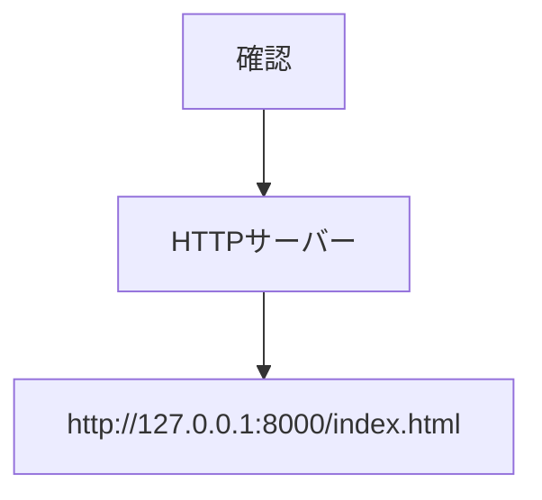

起動例。

```bash
python3 -m http.server 8000
```

静的サイトなので、HTTPサーバーで確認する。

## Git

- ローカルGitを使用する。
- GitHubは使わない方針。
- 既存変更を勝手に戻さない。

## 注意点

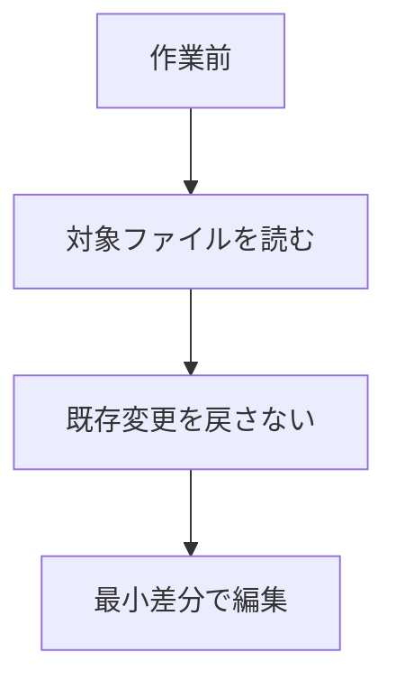

- 既存変更を勝手に戻さない。
- 実装前に対象ファイルを読み直す。
- CSSは既存構成を優先する。
- 機能別CSSは `components_v2.css` に混ぜない。
- 画像資産は `assets/images` に集約されている。
- 詳細ページ本文は `partials/details` に分離されている。
- PC左右バナーは `side-banners.css` と `shop-side-banners.js` を見る。
