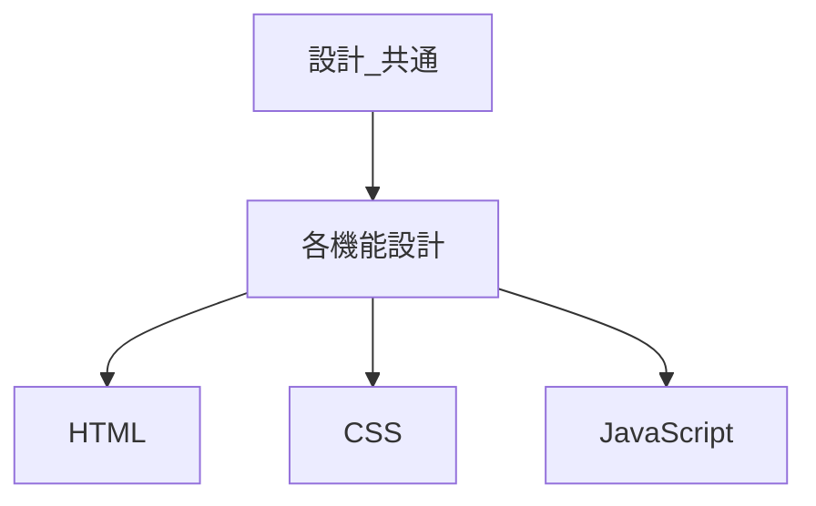
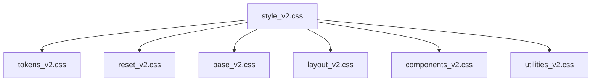

# 設計 共通

## 目的

サイト全体の実装方針を揃える。

## CSS設計

CSSはCSS設計2026版に従う。

| 項目 | 内容 |
|---|---|
| 参照元 | `/Users/mm3/Library/CloudStorage/GoogleDrive-tsujimomo.logs.2025@gmail.com/マイドライブ/_Live/2026_v2/projects/pr06/PR_2026-06-02_create。ルールを。CSS設計2026版を。/docs-CSS設計2026版_2026-06-02_05-23` |
| 適用範囲 | このサイト全体 |
| 基本方針 | 既存CSS構成を優先 |

## CSS配置

| 種類 | 配置 |
|---|---|
| トークン | `css/tokens_v2.css` |
| リセット | `css/reset_v2.css` |
| ベース | `css/base_v2.css` |
| レイアウト | `css/layout_v2.css` |
| UI部品 | `css/components_v2.css` |
| 汎用補助 | `css/utilities_v2.css` |

## 実装原則

| 項目 | 方針 |
|---|---|
| 既存優先 | 既存クラスとトークンを使う |
| 追加場所 | 役割に合うCSSファイルへ追加する |
| 例外 | 必要な場合だけ最小にする |
