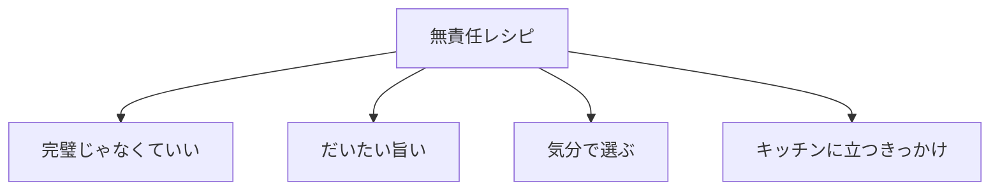

# 「無責任レシピ」とは。

## Overview

- 無責任レシピは、完璧を目指さない料理サイトです。
- きっちり計らなくてもいい。
- 手順どおりに進まなくてもいい。
- 今の気分で選んで、だいたい旨いところへ向かう。
- 家族や自分のために、キッチンに立つきっかけをつくる。
- それが「無責任レシピ」です。

## Overview
- 無責任レシピは、本体ECサイト[「Chapdaddy（チャプダディ）」](「Chapdaddy（チャプダディ）」とは。.md)のスピンオフサイトです。

