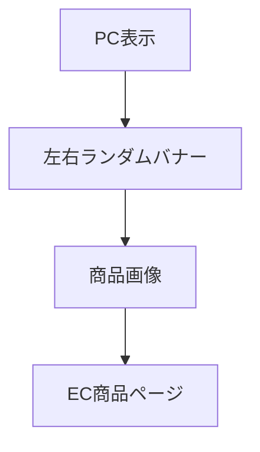
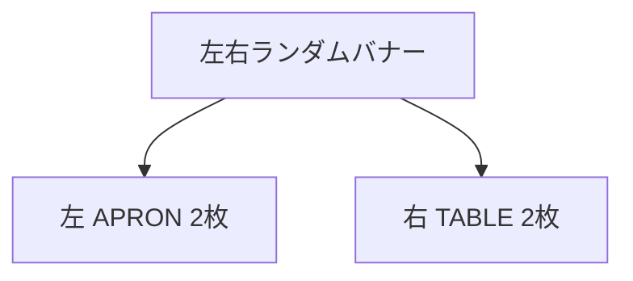

# 要件定義 PC左右ランダムバナー

## 目的

PC表示の左右余白からEC商品ページへ送客する。

## 対象

| 対象 | 内容 |
|---|---|
| 表示幅 | 1280px以上 |
| 表示位置 | 画面左右 |
| 表示状態 | スクロールしても固定 |
| 対象外 | 1279px以下 |

## 表示内容

| 項目 | 内容 |
|---|---|
| 左側 | APRON｜着る |
| 右側 | TABLE｜食べる |
| 表示枚数 | 左右それぞれ2枚 |
| 商品表示 | 画像のみ |
| 価格 | 表示しない |

## データ

既存JSONを使う。

| 種別 | JSON |
|---|---|
| APRON｜着る | `data/shop-apron.json` |
| TABLE｜食べる | `data/shop-table.json` |

JSONは以下を使う。

| キー | 用途 |
|---|---|
| `name` | 画像の `alt` |
| `image_url` | 商品画像 |
| `product_url` | 商品リンク |

## 挙動

| 項目 | 内容 |
|---|---|
| 抽選タイミング | ページ表示時 |
| 左側抽選 | APRONから2件 |
| 右側抽選 | TABLEから2件 |
| リンク | 別タブで開く |
| スクロール | 固定表示 |

## 画像仕様

| 項目 | 内容 |
|---|---|
| 比率 | 正方形 |
| 表示方法 | `contain` |
| 幅 | PC左右余白に収まる幅 |

## 関連機能

下部ECカルーセルとは別機能にする。
