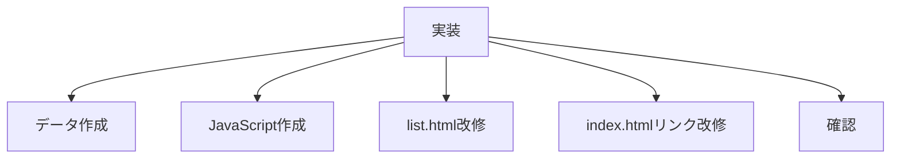
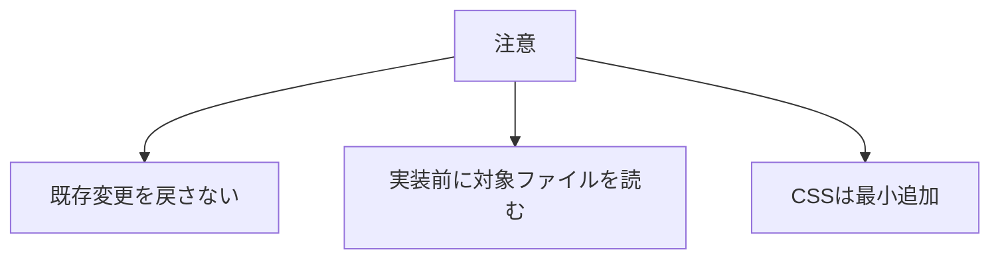

# タスク 気分一覧

## 目的

気分で絞り込める `list.html` を実装する。

## タスク

| 状態 | 項目 |
|---|---|
| 完了 | 対象ファイルを読み直す |
| 完了 | `data/recipes.json` を作成する |
| 完了 | 詳細ページ7件をJSONへ登録する |
| 完了 | `list.html` にJSON描画先を用意する |
| 完了 | `js/recipe-list.js` を作成する |
| 完了 | JavaScriptで `recipes.json` を読み込む |
| 完了 | JavaScriptで `mood` クエリを取得する |
| 完了 | JavaScriptでレシピを絞り込む |
| 完了 | JavaScriptで一覧HTMLを出力する |
| 完了 | 気分フィルターUIを追加する |
| 完了 | 0件表示を追加する |
| 完了 | `index.html` の気分リンクをクエリ付きにする |
| 完了 | JSONの `featured` 指定を削除する |
| 完了 | JavaScriptで表示対象をランダム並び替えする |
| 完了 | JavaScriptで表示結果の1件目に `c_list-recipe--featured` を付ける |
| 完了 | ランダム表示を確認する |
| 完了 | 気分別でも1件目がfeaturedになることを確認する |
| 完了 | ローカルHTTPで全件表示を確認する |
| 完了 | ローカルHTTPで気分別表示を確認する |
| 完了 | 無効な `mood` の挙動を確認する |

## 対象ファイル

| 種類 | ファイル |
|---|---|
| データ | `data/recipes.json` |
| 一覧 | `list.html` |
| JavaScript | `js/recipe-list.js` |
| TOP | `index.html` |
| CSS | 必要時のみ既存CSS |

## 確認URL

| 表示 | URL |
|---|---|
| 全件 | `http://127.0.0.1:8000/list.html` |
| ガッツリ | `http://127.0.0.1:8000/list.html?mood=hearty` |
| さっぱり | `http://127.0.0.1:8000/list.html?mood=light` |
| 疲れてる | `http://127.0.0.1:8000/list.html?mood=tired` |
| 酒飲みたい | `http://127.0.0.1:8000/list.html?mood=drink` |

## 注意

| 項目 | 内容 |
|---|---|
| 既存変更 | 勝手に戻さない |
| JS | 読み込み、絞り込み、出力を担当 |
| 表示順 | ページ表示ごとにランダム |
| featured | 表示結果の1件目に付与 |
| JSON失敗 | 既存静的HTMLを残す |
| CSS | 既存部品を優先 |
| 個別ページ | 気分別HTMLは作らない |
