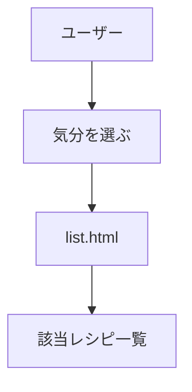
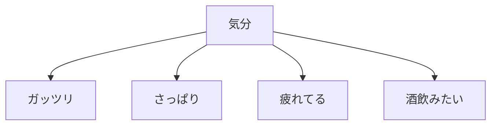
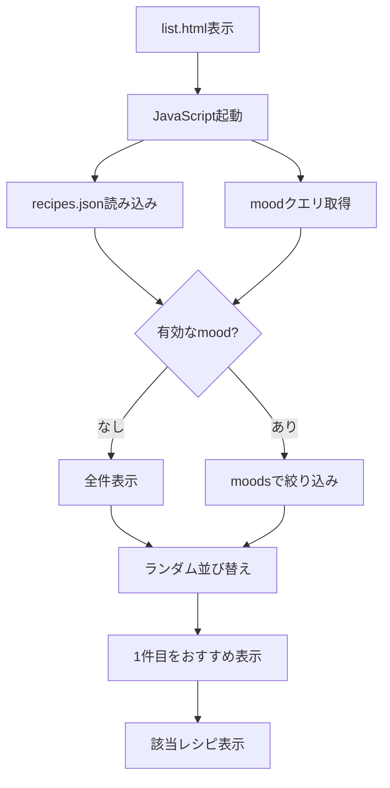

# 要件定義 気分一覧

## 目的

料理を気分で選べる一覧にする。

## 対象

| 対象 | 内容 |
|---|---|
| 一覧ページ | `list.html` |
| 処理 | JavaScript |
| データ | `data/recipes.json` |
| 対象レシピ | 詳細ページ7件 |
| 絞り込み | URLクエリ |
| 表示順 | ページ表示ごとにランダム |
| おすすめ表示 | 表示結果の1件目 |

## 気分

| 表示名 | ID |
|---|---|
| ガッツリ | `hearty` |
| さっぱり | `light` |
| 疲れてる | `tired` |
| 酒飲みたい | `drink` |

## URL

| 表示 | URL |
|---|---|
| 全件 | `list.html` |
| ガッツリ | `list.html?mood=hearty` |
| さっぱり | `list.html?mood=light` |
| 疲れてる | `list.html?mood=tired` |
| 酒飲みたい | `list.html?mood=drink` |

## データ項目

`data/recipes.json` の1件は以下を持つ。

| キー | 用途 |
|---|---|
| `title` | レシピ名 |
| `file` | 詳細ページURL |
| `image` | 一覧画像 |
| `scene` | 一覧の説明 |
| `time` | 調理時間 |
| `difficulty` | 難易度 |
| `calories` | カロリー |
| `moods` | 気分ID配列 |

## 挙動

| 状態 | 表示 |
|---|---|
| クエリなし | 全件 |
| 有効な気分ID | 該当レシピ |
| 無効な気分ID | 全件 |
| 表示順 | ページ表示ごとにランダム |
| 1件目 | `c_list-recipe--featured` |
| 該当0件 | 0件メッセージ |
| JSON取得失敗 | 既存静的HTMLを維持 |

## 対象外

| 対象外 | 内容 |
|---|---|
| 詳細ページ改修 | 気分表示は別途検討 |
| 気分別HTML | 個別ページは作らない |
| SEO専用ページ | 今回は対象外 |
