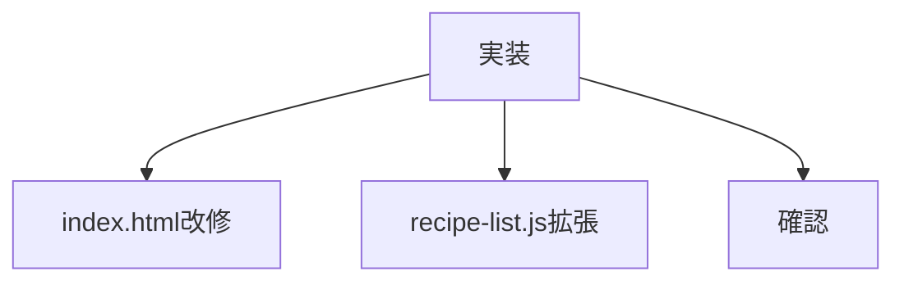
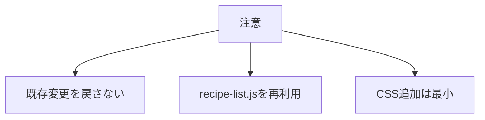

# タスク トップ今のおすすめ

## 目的

トップページにランダムなおすすめ3件を表示する。

## タスク

| 状態 | 項目 |
|---|---|
| 完了 | 対象ファイルを読み直す |
| 完了 | `index.html` に描画先を用意する |
| 完了 | 既存 `c_home-recipe` を削除する |
| 完了 | `recipe-list.js` をトップ表示に対応させる |
| 完了 | 全レシピからランダム3件を選ぶ |
| 完了 | 1件目に `c_list-recipe--featured` を付ける |
| 完了 | JSON取得失敗時の静的HTMLを維持する |
| 完了 | トップ表示をHTTPで確認する |
| 完了 | ランダム順を確認する |

## 対象ファイル

| 種類 | ファイル |
|---|---|
| TOP | `index.html` |
| JavaScript | `js/recipe-list.js` |
| データ | `data/recipes.json` |
| CSS | 必要時のみ既存CSS |

## 確認URL

| 表示 | URL |
|---|---|
| トップ | `http://127.0.0.1:8000/index.html` |

## 注意

| 項目 | 内容 |
|---|---|
| 表示対象 | 全レシピ |
| 表示件数 | 3件 |
| 表示順 | ページ表示ごとにランダム |
| featured | 表示結果の1件目 |
| フォールバック | 静的HTMLを残す |
