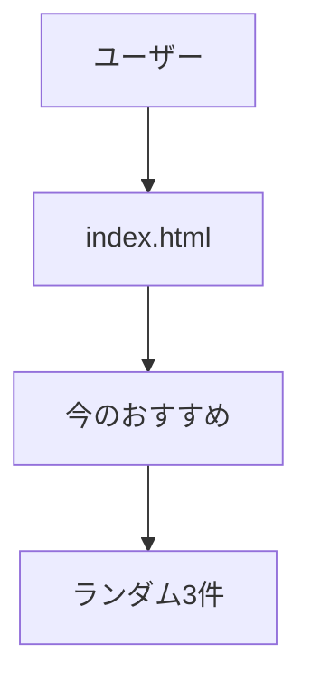
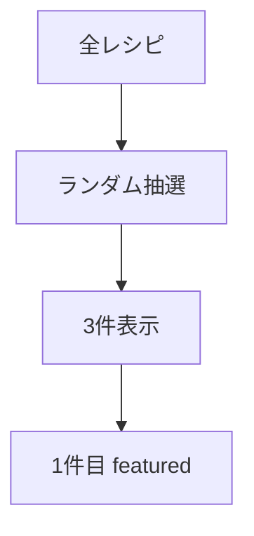
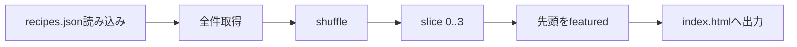

# 要件定義 トップ今のおすすめ

## 目的

トップページにランダムなおすすめレシピを表示する。

## 対象

| 対象 | 内容 |
|---|---|
| ページ | `index.html` |
| セクション | 今のおすすめ |
| データ | `data/recipes.json` |
| 処理 | JavaScript |
| JS | `js/recipe-list.js` |

## 表示内容

| 項目 | 内容 |
|---|---|
| 対象 | 全レシピ |
| 表示件数 | 3件 |
| 表示順 | ページ表示ごとにランダム |
| 1件目 | `c_list-recipe c_list-recipe--featured` |
| 2件目以降 | `c_list-recipe` |

## 既存要素

| 対象 | 方針 |
|---|---|
| `c_home-recipe` | 削除してよい |
| `c_list-recipe` | 再利用する |
| `recipe-list.js` | 再利用する |

## 挙動

| 状態 | 表示 |
|---|---|
| JSON取得成功 | ランダム3件 |
| JSON取得失敗 | 既存静的HTMLを維持 |
| レシピ0件 | 何も表示しない |

## 対象外

| 対象外 | 内容 |
|---|---|
| 気分絞り込み | トップでは行わない |
| 新規JSON | `recipes.json` を使う |
| 詳細ページ改修 | 対象外 |
