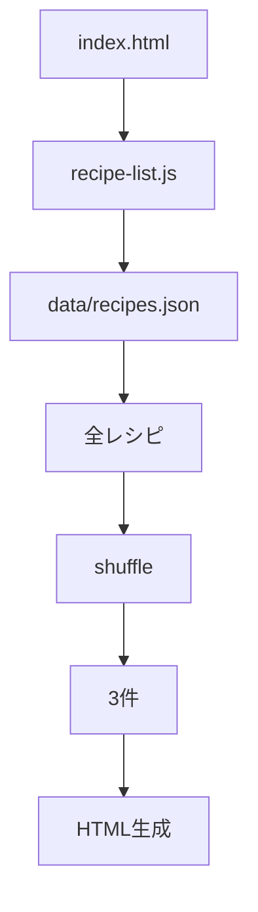
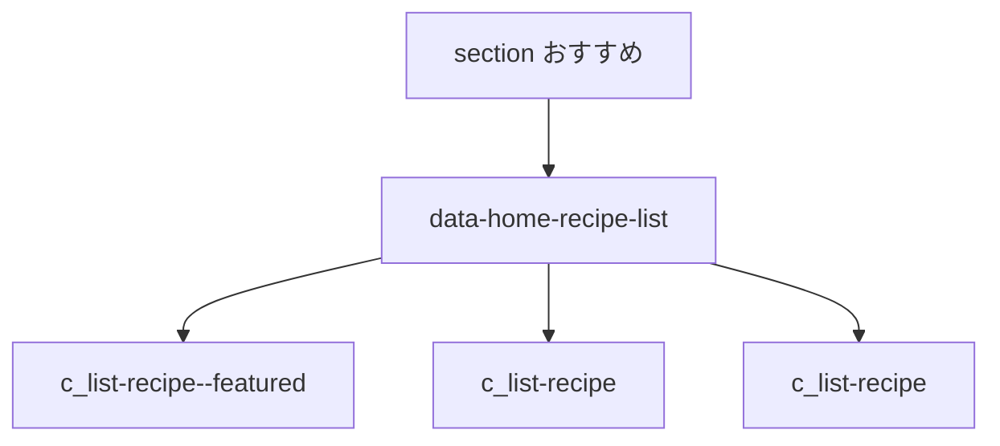
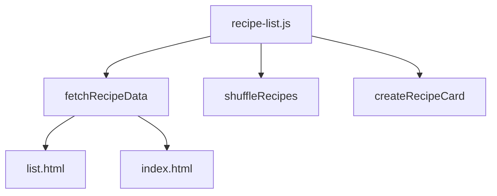

# 設計 トップ今のおすすめ

## 構成

`index.html` が `recipe-list.js` を使っておすすめを表示する。

## JavaScript

`recipe-list.js` にトップ用の処理を追加する。

| 項目 | 内容 |
|---|---|
| 描画先 | `[data-home-recipe-list]` |
| データ取得 | `fetch('./data/recipes.json')` |
| 対象 | 全レシピ |
| 表示件数 | 3件 |
| 並び順 | ランダム |
| featured | 表示配列の1件目 |

## HTML

`index.html` の「おすすめ」セクションに描画先を置く。

| 要素 | 用途 |
|---|---|
| `[data-home-recipe-list]` | おすすめ3件の出力先 |
| `.c_list-recipe` | カード表示 |
| `.c_list-recipe--featured` | 先頭カード |

## 共通化

一覧ページとトップページで同じ処理を使う。

| 関数 | 用途 |
|---|---|
| `fetchRecipeData` | JSON取得 |
| `shuffleRecipes` | ランダム並び替え |
| `createRecipeCard` | カードHTML生成 |

## CSS

既存の `c_list-recipe` を使う。

| 種類 | 配置 |
|---|---|
| 既存カード | `css/components_v2.css` |
| 追加CSS | 必要時のみ最小 |

## エラー時

| 状態 | 対応 |
|---|---|
| JSON取得失敗 | 静的HTMLを残す |
| レシピ3件未満 | 取得できた件数だけ表示 |
| レシピ0件 | 描画しない |

## 実装対象外

| 対象外 | 内容 |
|---|---|
| 気分別表示 | `list.html` のみ |
| 新規コンポーネント | 作らない |
| ECバナー | 触らない |
