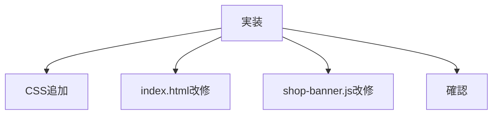

# タスク 見出しコンポーネント

## 目的

見出しを `c_heading` として共通化する。

## タスク

| 状態 | 項目 |
|---|---|
| 完了 | 対象ファイルを読み直す |
| 完了 | `c_heading` CSSを追加する |
| 完了 | `c_heading__icon--chapdaddy` を追加する |
| 完了 | `index.html` の番号を削除する |
| 完了 | `index.html` の見出しを `c_heading` に置き換える |
| 完了 | `shop-banner.js` のEC見出しを `c_heading` に置き換える |
| 完了 | `.c_shop-carousel .text-hd-t02` 依存を整理する |
| 完了 | HTTPでTOPを確認する |
| 完了 | HTTPでEC見出しを確認する |

## 対象ファイル

| 種類 | ファイル |
|---|---|
| TOP | `index.html` |
| EC | `js/shop-banner.js` |
| CSS | `css/components_v2.css` |
| 必要時 | `css/shop-carousel.css` |

## 確認URL

| 表示 | URL |
|---|---|
| TOP | `http://127.0.0.1:8000/index.html` |

## 注意

| 項目 | 内容 |
|---|---|
| 番号 | 削除 |
| `text-hd-t02` | 文字スタイルとして残す |
| アイコン | modifierで差分管理 |
| `id` | 使わない |
