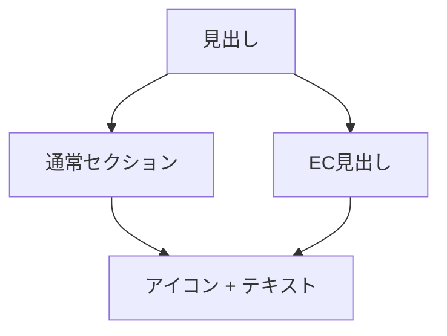
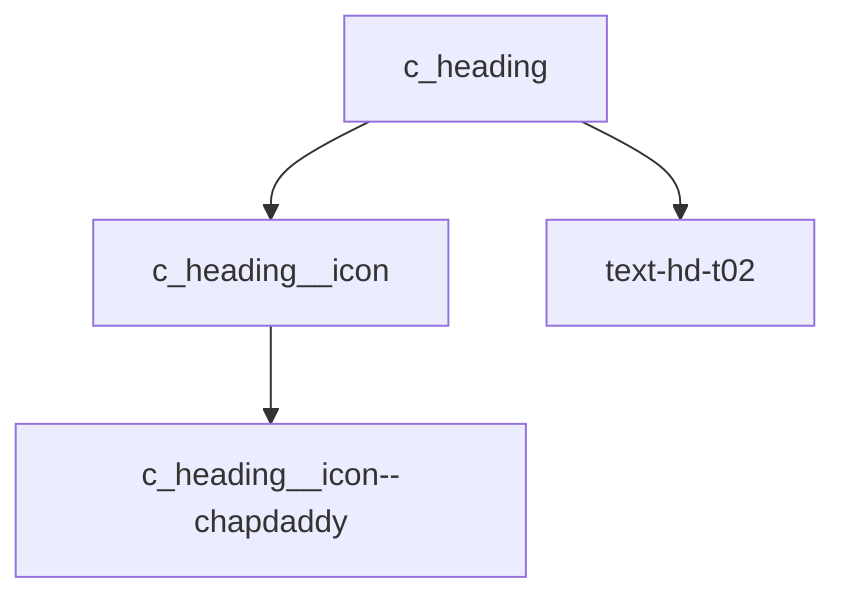

# 要件定義 見出しコンポーネント

## 目的

サイト内の見出し表現を共通化する。

## 対象

| 対象 | 内容 |
|---|---|
| TOP | `index.html` |
| EC | `shop-banner.js` |
| CSS | `css/components_v2.css` |
| 参照元 | `.c_shop-carousel .text-hd-t02` |

## 表示内容

| 要素 | 内容 |
|---|---|
| アイコン | Chapdaddyアイコン |
| テキスト | 見出し文言 |
| 番号 | 削除 |

## コンポーネント

| クラス | 用途 |
|---|---|
| `c_heading` | 見出し全体 |
| `c_heading--section` | 通常セクション用 |
| `c_heading--shop` | EC見出し用 |
| `c_heading__icon` | アイコン共通 |
| `c_heading__icon--chapdaddy` | Chapdaddyアイコン |

## 方針

| 項目 | 内容 |
|---|---|
| `text-hd-t02` | 文字スタイルとして残す |
| 番号 | トップ見出しから削除 |
| `id` | 使わない |
| アイコン差分 | modifierで扱う |
| shop依存 | `.c_shop-carousel` から切り離す |

## 対象外

| 対象外 | 内容 |
|---|---|
| 見出し文言変更 | 対象外 |
| 新規画像作成 | 対象外 |
| 詳細ページ見出し | 必要時に別途対応 |
