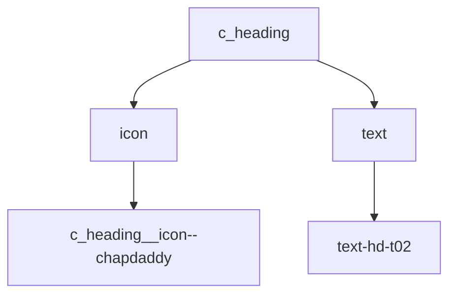
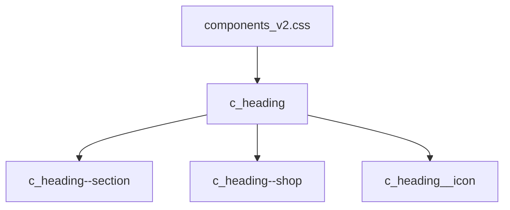
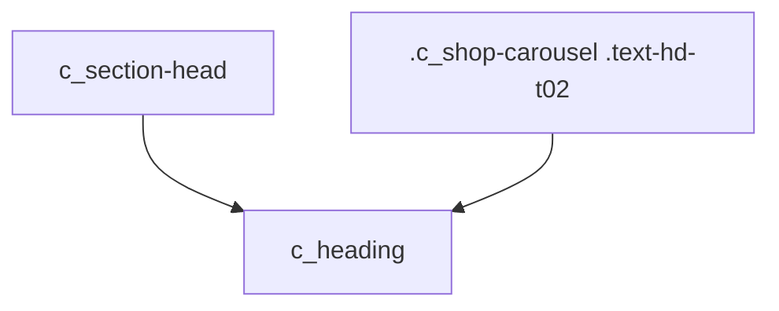

# 設計 見出しコンポーネント

## 構成

`c_heading` を新規作成する。



## HTML

通常セクション。

```html
<div class="c_heading c_heading--section">
  
  <h2 class="text-hd-t02">気分で選ぶ</h2>
</div>
```

EC見出し。

```html
<div class="c_heading c_heading--shop">
  
  <h2 class="text-hd-t02">APRON｜着る</h2>
</div>
```

## CSS

CSSは `components_v2.css` に置く。



| クラス | 方針 |
|---|---|
| `c_heading` | 横並び中央寄せ |
| `c_heading--section` | セクション見出し用 |
| `c_heading--shop` | EC見出し用 |
| `c_heading__icon` | 共通サイズ |
| `c_heading__icon--chapdaddy` | Chapdaddy用サイズ |

## 置き換え



| 対象 | 対応 |
|---|---|
| TOP見出し | `c_heading c_heading--section` |
| EC見出し | `c_heading c_heading--shop` |
| 番号 | 削除 |
| shop依存CSS | 削除または縮小 |

## 注意

| 項目 | 内容 |
|---|---|
| `id` | 使わない |
| アイコン追加 | modifier追加で対応 |
| CSS追加 | 最小限 |
| 既存変更 | 勝手に戻さない |
