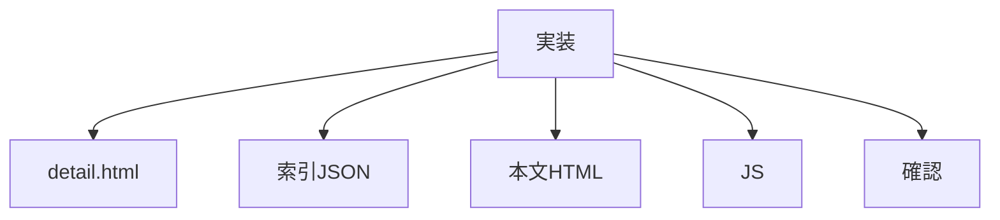

# タスク 詳細ページ共通化

## 目的

`detail.html` で詳細本文HTMLを読み込む。

## タスク

| 状態 | 項目 |
|---|---|
| 完了 | 対象詳細ページを読み直す |
| 完了 | `detail.html` を作成する |
| 完了 | `js/detail-loader.js` を作成する |
| 完了 | `data/recipe-details.json` を作成する |
| 完了 | 本文HTML用フォルダを作成する |
| 完了 | 7件分の本文HTMLを切り出す |
| 完了 | `detail.html?id=...` で読み込む |
| 完了 | idなしのエラー表示を作る |
| 完了 | id不正のエラー表示を作る |
| 完了 | HTTPで表示確認する |
| 完了 | `list.html` のリンクを新URLへ変更する |
| 完了 | `index.html` のリンクを新URLへ変更する |
| 完了 | 旧 `detail_〇〇.html` を削除する |

## 対象ファイル

| 種類 | ファイル |
|---|---|
| 共通詳細 | `detail.html` |
| JS | `js/detail-loader.js` |
| 索引 | `data/recipe-details.json` |
| 本文 | `partials/details/*.html` |

## 確認URL

| 表示 | URL |
|---|---|
| 例 | `http://127.0.0.1:8000/detail.html?id=hamburg` |
| idなし | `http://127.0.0.1:8000/detail.html` |

## 注意

| 項目 | 内容 |
|---|---|
| 旧詳細HTML | 削除済み |
| 詳細JSON完全化 | しない |
| 本文HTML | 固有コンテンツだけ |
| script | 本文HTMLに入れない |
| 移行 | 7件完了 |
