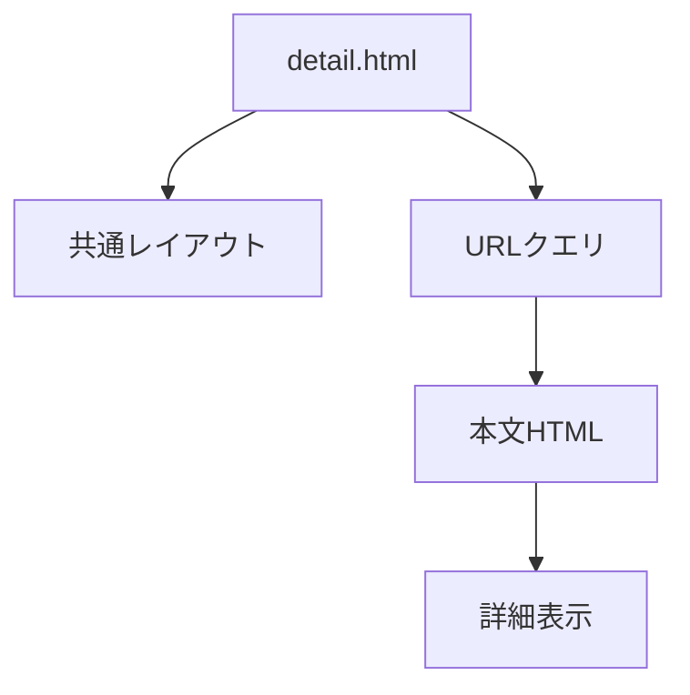
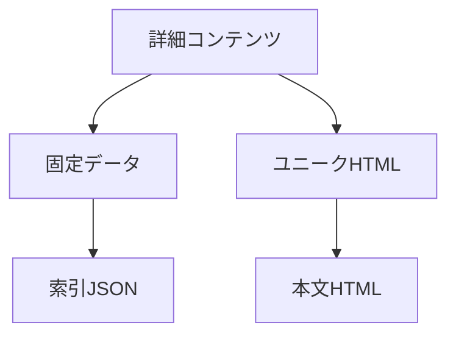
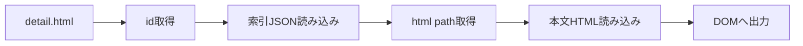

# 要件定義 詳細ページ共通化

## 目的

詳細ページの共通部分を `detail.html` に集約する。



## 対象

| 対象 | 内容 |
|---|---|
| 共通ページ | `detail.html` |
| 索引データ | `data/recipe-details.json` |
| 本文 | `partials/details/*.html` |
| 処理 | JavaScript |

## 方針

詳細コンテンツはJSON完全化しない。



| 項目 | 方針 |
|---|---|
| 共通UI | `detail.html` |
| 本文 | 個別HTML partial |
| JSON | id / title / html path |
| 旧詳細HTML | 削除済み |

## URL

| 表示 | URL |
|---|---|
| ハンバーグ | `detail.html?id=hamburg` |
| からあげ | `detail.html?id=karaage` |
| うにパスタ | `detail.html?id=uni_cream_pasta` |

旧 `detail_〇〇.html` は使わない。

## 索引JSON

```json
[
  {
    "id": "hamburg",
    "title": "びくどん風ハンバーグ",
    "html": "./partials/details/detail_hamburg.html"
  }
]
```

## 挙動



| 状態 | 表示 |
|---|---|
| id有効 | 対応する本文HTML |
| idなし | エラー表示 |
| id不正 | エラー表示 |
| HTML取得失敗 | エラー表示 |

## 対象外

| 対象外 | 内容 |
|---|---|
| 詳細JSON完全化 | しない |
| 個別CSS大量追加 | しない |
