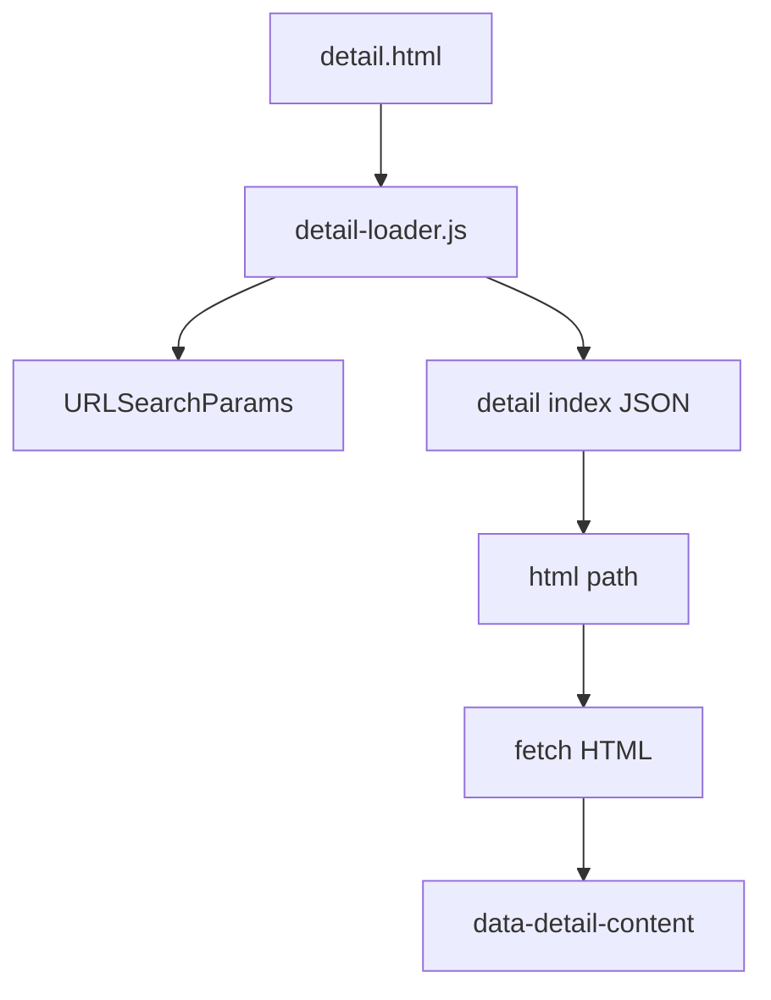
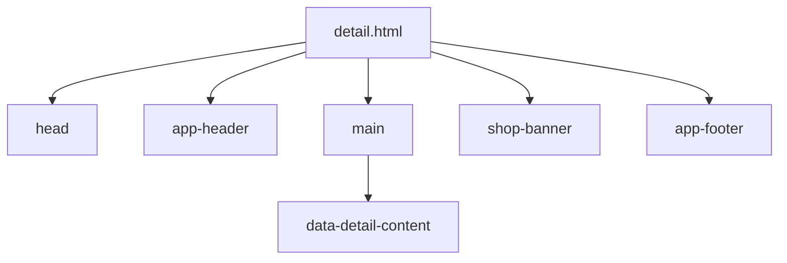
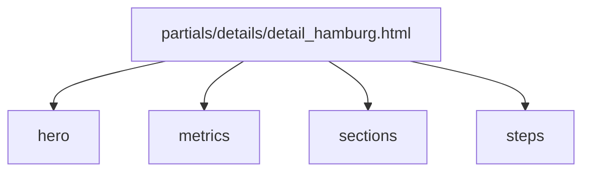
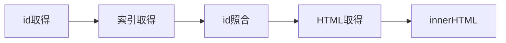
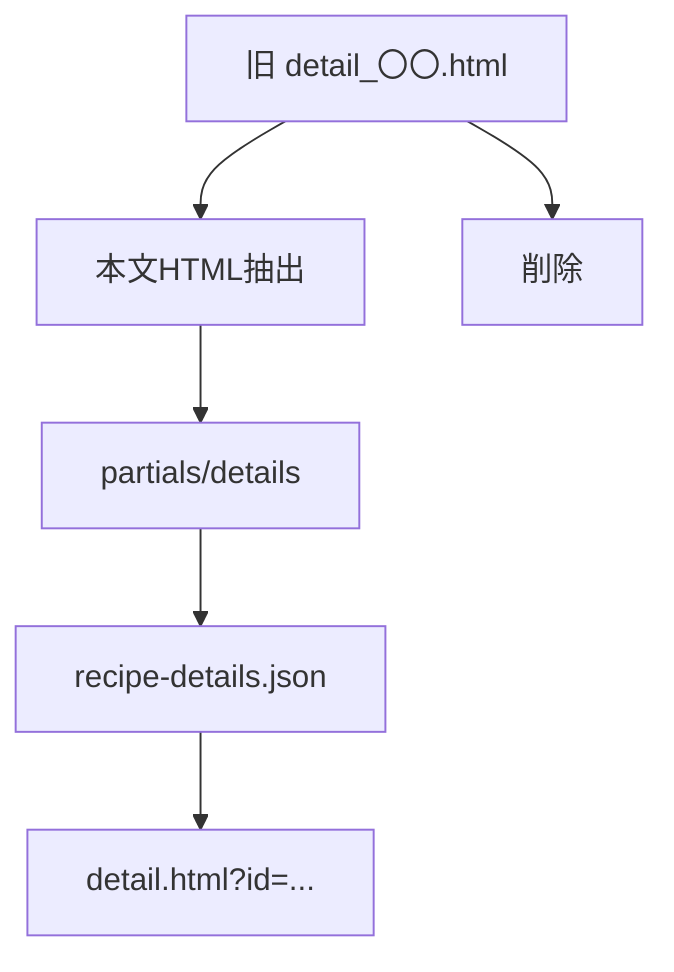

# 設計 詳細ページ共通化

## 構成

`detail.html` が索引JSONを読み、本文HTMLをincludeする。



## ファイル

| 種類 | 候補 |
|---|---|
| 共通ページ | `detail.html` |
| JS | `js/detail-loader.js` |
| 索引JSON | `data/recipe-details.json` |
| 本文HTML | `partials/details/detail_〇〇.html` |

## detail.html

共通レイアウトだけを持つ。



| 要素 | 用途 |
|---|---|
| `[data-detail-content]` | 本文HTML出力先 |
| `[data-detail-error]` | エラー表示 |

## 索引JSON

JSONは本文HTMLへの索引にする。

```json
[
  {
    "id": "hamburg",
    "title": "びくどん風ハンバーグ",
    "html": "./partials/details/detail_hamburg.html"
  }
]
```

| キー | 用途 |
|---|---|
| `id` | URLクエリ |
| `title` | タイトル表示・検証 |
| `html` | include先 |

## 本文HTML

本文HTMLは詳細ページ固有部分だけを持つ。



本文HTMLに含めないもの。

| 含めない | 理由 |
|---|---|
| `<html>` | 共通ページが持つ |
| `<head>` | 共通ページが持つ |
| `app-header` | 共通ページが持つ |
| `shop-banner` | 共通ページが持つ |
| `app-footer` | 共通ページが持つ |
| `<script>` | include時の挙動を単純にする |

## JS



| 関数 | 用途 |
|---|---|
| `getDetailId` | id取得 |
| `fetchDetailIndex` | 索引JSON取得 |
| `findDetail` | 対象検索 |
| `fetchDetailHtml` | 本文HTML取得 |
| `renderDetail` | DOM出力 |

## 移行方針

7件すべてを共通詳細へ移行する。



## 注意

| 項目 | 内容 |
|---|---|
| 旧詳細HTML | 削除済み |
| script | 本文HTMLに入れない |
| CSS | 既存クラスを使う |
| SEO | JS includeのため弱くなる |
