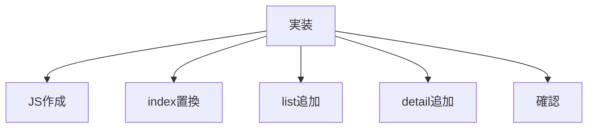

# タスク 気分で選ぶコンポーネント

## 目的

「気分で選ぶ」を3ページで再利用する。

## タスク

| 状態 | 項目 |
|---|---|
| 完了 | `index.html` の既存セクションを確認する |
| 完了 | `js/mood-section.js` を作成する |
| 完了 | `<mood-section>` を定義する |
| 完了 | `index.html` の既存セクションを置換する |
| 完了 | `list.html` に `<mood-section>` を追加する |
| 完了 | `detail.html` に `<mood-section>` を追加する |
| 完了 | 3ページでJSを読み込む |
| 完了 | 3ページのHTML配置を確認する |
| 完了 | 各カードのリンクを確認する |
| 未着手 | ブラウザで表示崩れを確認する |

## 対象ファイル

| 種類 | ファイル |
|---|---|
| 追加 | `js/mood-section.js` |
| 変更 | `index.html` |
| 変更 | `list.html` |
| 変更 | `detail.html` |

## 確認URL

| ページ | URL |
|---|---|
| トップ | `http://127.0.0.1:8000/index.html` |
| 一覧 | `http://127.0.0.1:8000/list.html` |
| 詳細 | `http://127.0.0.1:8000/detail.html?id=hamburg` |

## 完了条件

| 条件 | 内容 |
|---|---|
| 表示 | 3ページに表示される |
| トップ位置 | 既存位置にある |
| 追加先位置 | `<shop-banner>` の上にある |
| 遷移 | 各気分が一覧へ遷移する |
| 重複 | `index.html` で二重表示しない |
