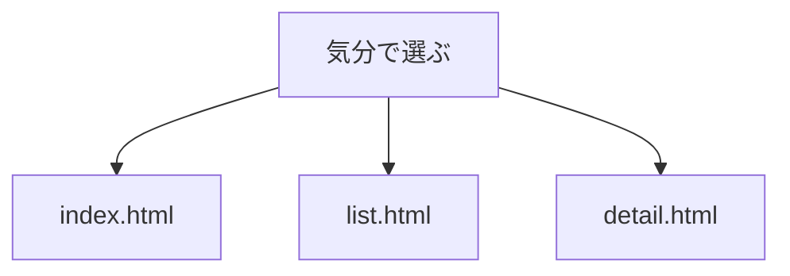
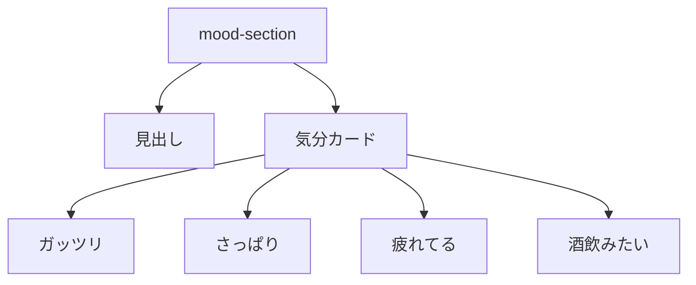

# 要件定義 気分で選ぶコンポーネント

## 目的

セクション「気分で選ぶ」を共通コンポーネントにする。

## 対象

| 対象 | 内容 |
|---|---|
| 既存元 | `index.html` |
| 追加先 | `list.html` |
| 追加先 | `detail.html` |
| トップ配置 | 既存位置 |
| 追加先配置 | `<shop-banner>` の上 |
| 実装 | JavaScript custom element |

## 表示内容

| 気分 | URL |
|---|---|
| ガッツリ | `list.html?mood=hearty` |
| さっぱり | `list.html?mood=light` |
| 疲れてる | `list.html?mood=tired` |
| 酒飲みたい | `list.html?mood=drink` |

## 方針

| 項目 | 方針 |
|---|---|
| HTML | `<mood-section>` で出力 |
| 見出し | `.c_heading` を使う |
| カード | 既存 `.c_home-mood` を使う |
| 画像 | 既存画像を使う |
| CSS | 既存CSSを優先する |

## 対象外

| 対象外 | 内容 |
|---|---|
| 気分項目追加 | しない |
| レシピJSON連動 | しない |
| デザイン全面変更 | しない |
