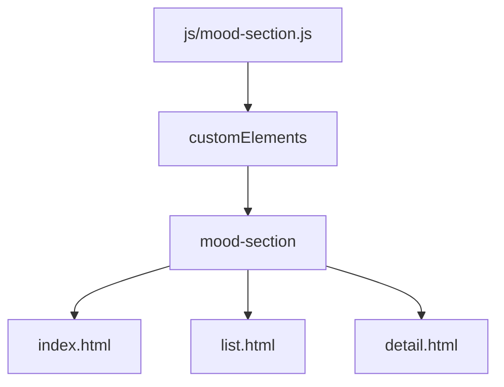
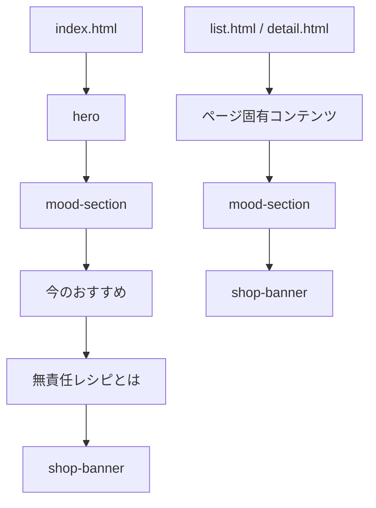
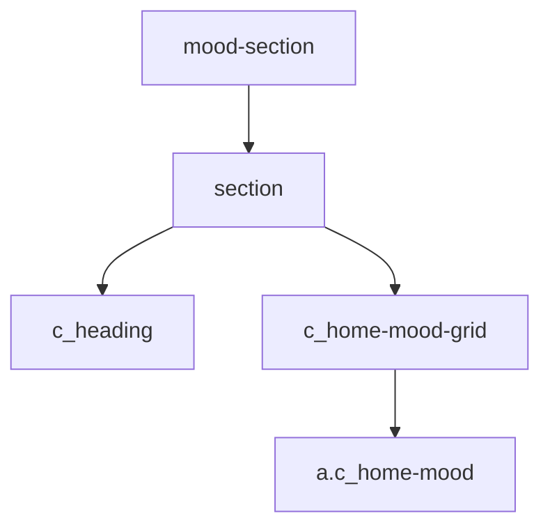
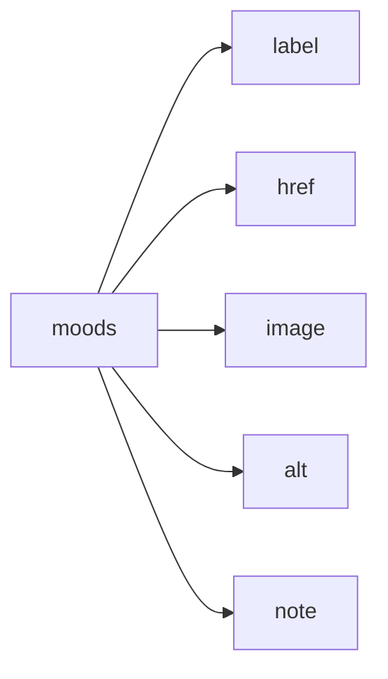

# 設計 気分で選ぶコンポーネント

## 構成

`mood-section.js` が `<mood-section>` を描画する。



## ファイル

| 種類 | ファイル |
|---|---|
| JS | `js/mood-section.js` |
| 利用元 | `index.html` |
| 利用元 | `list.html` |
| 利用元 | `detail.html` |
| CSS | 既存CSS |

## HTML配置



| ページ | 配置 |
|---|---|
| `index.html` | 既存セクション位置 |
| `list.html` | `<shop-banner>` の直前 |
| `detail.html` | `<shop-banner>` の直前 |

## コンポーネント

```html
<mood-section></mood-section>
```

## 出力HTML



| 要素 | クラス |
|---|---|
| section | `la_section la_stack u_stack_20` |
| heading | `c_heading c_heading--center` |
| grid | `la_grid c_home-mood-grid` |
| card | `c_home-mood` |

## データ

データはJS内に固定で持つ。



| キー | 用途 |
|---|---|
| `label` | 表示名 |
| `href` | 遷移先 |
| `image` | 画像 |
| `alt` | 代替テキスト |
| `note` | 補足文 |

## 注意

| 項目 | 内容 |
|---|---|
| 二重表示 | `index.html` の既存HTMLを置換する |
| URL | `list.html?mood=...` を使う |
| CSS | 既存 `.c_home-mood` を維持する |
| 依存 | `<shop-banner>` とは分離する |
