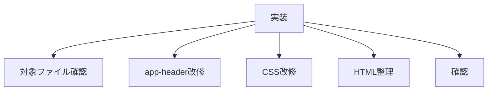

# タスク ヘッダーナビ改修

## 目的

全ページ共通のヘッダーナビを実装する。

## タスク

| 状態 | 項目 |
|---|---|
| 完了 | 対象ファイルを読み直す |
| 完了 | `js/app-header.js` をナビ型に変更する |
| 完了 | `css/components_v2.css` のヘッダーCSSを変更する |
| 完了 | Material Symbolsの読み込みを追加する |
| 完了 | `index.html` の `app-header` 属性を整理する |
| 完了 | `list.html` の `app-header` 属性を整理する |
| 完了 | `detail.html` の `app-header` 属性を整理する |
| 完了 | TOPをHTTP確認する |
| 完了 | 一覧をHTTP確認する |
| 完了 | 詳細をHTTP確認する |

## 対象ファイル

| 種類 | ファイル |
|---|---|
| 共通ヘッダー | `js/app-header.js` |
| CSS | `css/components_v2.css` |
| TOP | `index.html` |
| 一覧 | `list.html` |
| 詳細 | `detail.html` |

## 確認URL

| 表示 | URL |
|---|---|
| TOP | `http://127.0.0.1:8000/index.html` |
| 一覧 | `http://127.0.0.1:8000/list.html` |
| 詳細 | `http://127.0.0.1:8000/detail.html?id=karaage` |

## 完了条件

| 条件 | 内容 |
|---|---|
| 共通表示 | 全ページで同じヘッダー |
| ホーム | `index.html` へ遷移 |
| 気分で選ぶ | `list.html` へ遷移 |
| 旧要素 | 戻るボタンとsubtitleが出ない |
| 表示 | スマホ幅で破綻しない |
