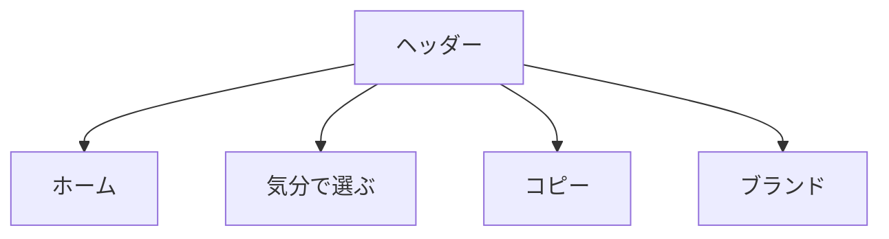

# 要件定義 ヘッダーナビ改修

## 目的

全ページ共通のヘッダーナビにする。

## 対象

| 対象 | 内容 |
|---|---|
| TOP | `index.html` |
| 一覧 | `list.html` |
| 詳細 | `detail.html` |
| JS | `js/app-header.js` |
| CSS | `css/components_v2.css` |

## 表示内容

| 要素 | 内容 |
|---|---|
| ホーム | アイコン。`index.html` へ遷移 |
| 矢印 | `気分で選ぶ` の前に表示 |
| 気分で選ぶ | `list.html` へ遷移 |
| コピー | `考えすぎない男飯` |
| ブランド | `無責任レシピ` |

## 方針

| 項目 | 内容 |
|---|---|
| 共通化 | 全ページ同じヘッダー |
| 戻るボタン | 廃止 |
| subtitle | 廃止 |
| Material Symbols | home と arrow を使う |
| 実装範囲 | ヘッダーのみ |

## 対象外

| 対象外 | 内容 |
|---|---|
| レシピ表示 | 対象外 |
| ECバナー | 対象外 |
| ページ本文 | 対象外 |
| 新規画像作成 | 対象外 |
