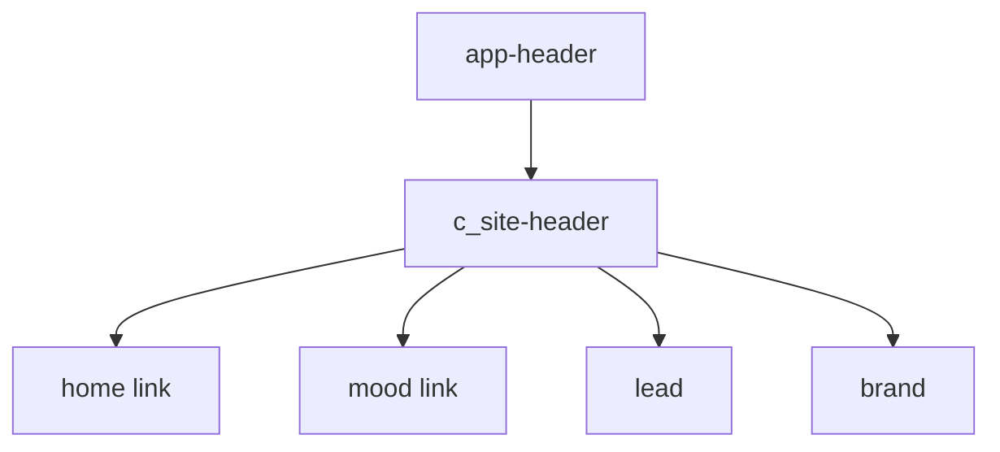
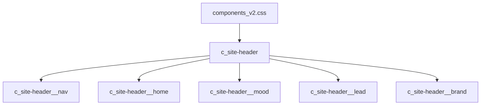
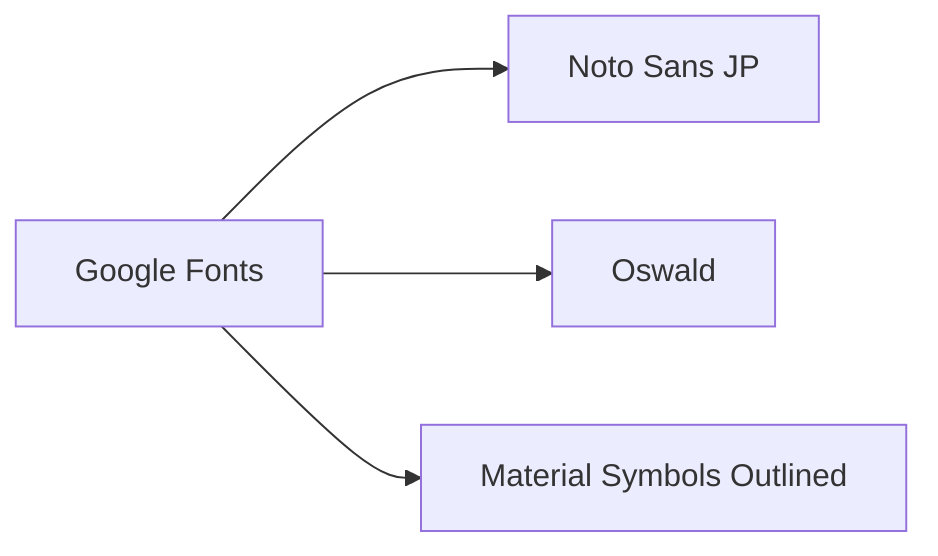
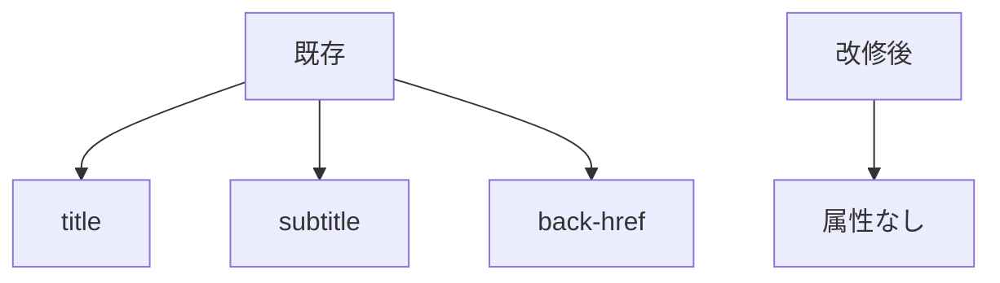

# 設計 ヘッダーナビ改修

## 構成

`app-header` をナビ型ヘッダーに変更する。



## HTML

`app-header` が以下を出力する。

```html
<header class="c_site-header">
  <nav class="c_site-header__nav" aria-label="サイトナビ">
    <a class="c_site-header__home" href="index.html" aria-label="ホーム">
      <span class="material-symbols-outlined" aria-hidden="true">home</span>
    </a>
    <a class="c_site-header__mood" href="list.html">
      <span class="material-symbols-outlined" aria-hidden="true">arrow_forward</span>
      <span>気分で選ぶ</span>
    </a>
  </nav>
  <p class="c_site-header__lead">考えすぎない男飯</p>
  <p class="c_site-header__brand">無責任レシピ</p>
</header>
```

## CSS

CSSは `components_v2.css` に置く。



| クラス | 方針 |
|---|---|
| `c_site-header` | 横並び。白背景。下線 |
| `c_site-header__nav` | home と気分で選ぶを横並び |
| `c_site-header__home` | アイコンリンク |
| `c_site-header__mood` | 矢印アイコン + テキスト |
| `c_site-header__lead` | 小さめコピー |
| `c_site-header__brand` | 太字ブランド |

## Material Symbols

既存Google FontsにMaterial Symbolsを追加する。



| アイコン | 文字 |
|---|---|
| home | `home` |
| arrow | `arrow_forward` |

## HTML属性

各ページの `app-header` 属性を整理する。



## 注意

| 項目 | 内容 |
|---|---|
| スマホ幅 | 文字詰まりを防ぐ |
| 詳細ページ | 戻るボタンは出さない |
| 外部依存 | Material Symbols読込失敗時も文字が崩れにくくする |
| 既存変更 | 勝手に戻さない |
