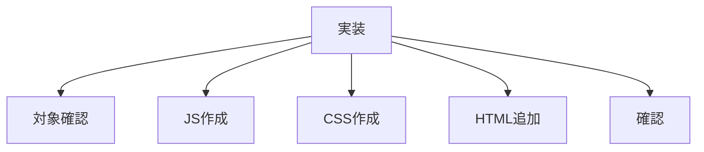

# タスク パンくずリスト作成

## 目的

全ページにパンくずリストを実装する。

## タスク

| 状態 | 項目 |
|---|---|
| 完了 | 対象ファイルを読み直す |
| 完了 | `js/app-breadcrumb.js` を作成する |
| 完了 | `css/breadcrumb.css` を作成する |
| 完了 | `css/style_v2.css` にimportを追加する |
| 完了 | `index.html` に `app-breadcrumb` を追加する |
| 完了 | `list.html` に `app-breadcrumb` を追加する |
| 完了 | `detail.html` に `app-breadcrumb` を追加する |
| 完了 | `detail-loader.js` からレシピ名を通知する |
| 完了 | TOPをHTTP確認する |
| 完了 | 一覧をHTTP確認する |
| 完了 | 詳細をHTTP確認する |

## 対象ファイル

| 種類 | ファイル |
|---|---|
| パンくずJS | `js/app-breadcrumb.js` |
| 詳細JS | `js/detail-loader.js` |
| CSS | `css/breadcrumb.css` |
| CSS入口 | `css/style_v2.css` |
| TOP | `index.html` |
| 一覧 | `list.html` |
| 詳細 | `detail.html` |

## 確認URL

| 表示 | URL |
|---|---|
| TOP | `http://127.0.0.1:8000/index.html` |
| 一覧 | `http://127.0.0.1:8000/list.html` |
| 詳細 | `http://127.0.0.1:8000/detail.html?id=karaage` |

## 完了条件

| 条件 | 内容 |
|---|---|
| TOP | `HOME` が表示される |
| 一覧 | `HOME > 一覧` が表示される |
| 詳細 | `HOME > 一覧 > レシピ名` が表示される |
| 位置 | ヘッダー直下に表示される |
| 表示 | スマホ幅で破綻しない |
