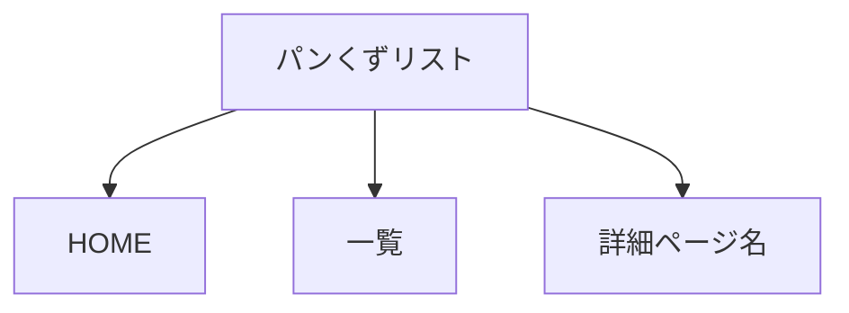
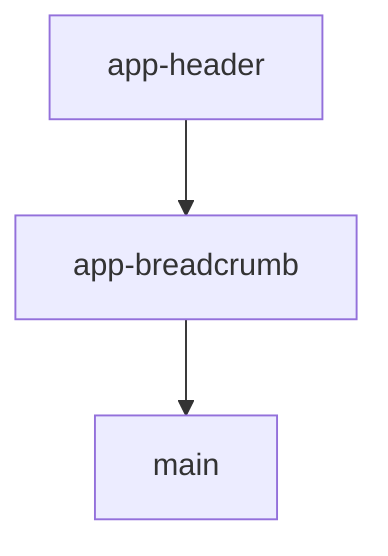

# 要件定義 パンくずリスト作成

## 目的

全ページに現在位置を表示する。

## 対象

| 対象 | 内容 |
|---|---|
| TOP | `index.html` |
| 一覧 | `list.html` |
| 詳細 | `detail.html` |
| JS | `js/app-breadcrumb.js` |
| CSS | `css/breadcrumb.css` |

## 表示内容

| ページ | 表示 |
|---|---|
| TOP | `HOME` |
| 一覧 | `HOME > 一覧` |
| 詳細 | `HOME > 一覧 > レシピ名` |

## 表示位置

ヘッダー直下に表示する。

## 方針

| 項目 | 内容 |
|---|---|
| 共通化 | 全ページ同じコンポーネントを使う |
| 詳細名 | 実際のレシピ名を表示する |
| CSS | 専用CSSにする |
| デザイン | 指示画像の茶色帯に合わせる |

## 対象外

| 対象外 | 内容 |
|---|---|
| ヘッダーナビ変更 | 対象外 |
| レシピ本文変更 | 対象外 |
| ECバナー変更 | 対象外 |
| 新規画像作成 | 対象外 |
