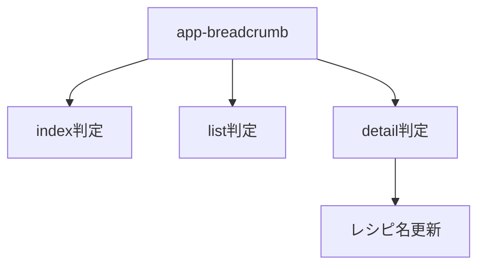
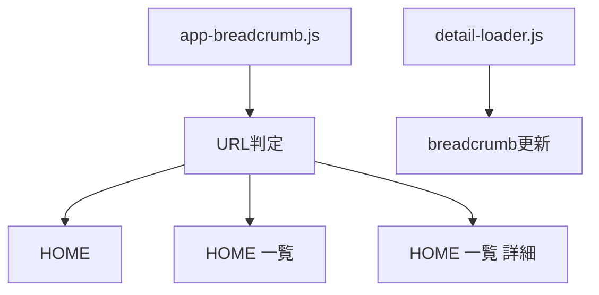
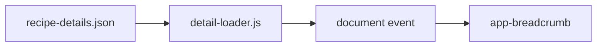
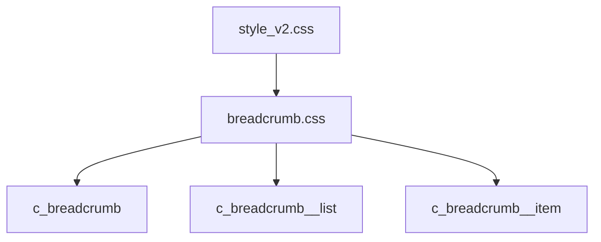

# 設計 パンくずリスト作成

## 構成

`app-breadcrumb` を新規作成する。



## HTML

各ページで `app-header` の直後に置く。

```html
<app-header></app-header>
<app-breadcrumb></app-breadcrumb>
```

出力HTML。

```html
<nav class="c_breadcrumb" aria-label="パンくずリスト">
  <ol class="c_breadcrumb__list">
    <li class="c_breadcrumb__item"><a href="index.html">HOME</a></li>
    <li class="c_breadcrumb__item"><a href="list.html">一覧</a></li>
    <li class="c_breadcrumb__item" aria-current="page">レシピ名</li>
  </ol>
</nav>
```

## JS

JSは `js/app-breadcrumb.js` に置く。



| 処理 | 内容 |
|---|---|
| TOP | `HOME` を表示 |
| 一覧 | `HOME > 一覧` を表示 |
| 詳細 | 初期表示は詳細を仮表示 |
| 詳細更新 | レシピ名取得後に差し替える |

## 詳細ページ名

`detail-loader.js` がレシピ名を通知する。



イベント名。

| 項目 | 内容 |
|---|---|
| event | `recipe-detail:loaded` |
| detail | `{ title }` |

## CSS

CSSは `css/breadcrumb.css` に置く。



| クラス | 方針 |
|---|---|
| `c_breadcrumb` | 茶色背景の帯 |
| `c_breadcrumb__list` | 横並び |
| `c_breadcrumb__item` | 文字と区切り |
| `aria-current` | 現在ページに付ける |

## 注意

| 項目 | 内容 |
|---|---|
| アクセシビリティ | `nav` と `aria-label` を使う |
| リンク | 現在ページはリンクにしない |
| スマホ幅 | 横にはみ出さない |
| 既存変更 | 勝手に戻さない |
