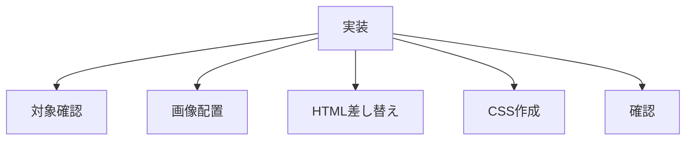

# タスク 無責任レシピとは

## 目的

「無責任レシピとは」セクションを実装する。

## タスク

| 状態 | 項目 |
|---|---|
| 完了 | 対象ファイルを読み直す |
| 完了 | 背景画像を `assets/images` に複製する |
| 不要 | 必要なら背景画像を軽量化する |
| 完了 | `css/about-recipe.css` を作成する |
| 完了 | `css/style_v2.css` にimportを追加する |
| 完了 | `index.html` の仮セクションを差し替える |
| 完了 | Chapdaddyリンクを追加する |
| 完了 | arrow iconを追加する |
| 完了 | HTTPでTOPを確認する |

## 対象ファイル

| 種類 | ファイル |
|---|---|
| TOP | `index.html` |
| CSS | `css/about-recipe.css` |
| CSS入口 | `css/style_v2.css` |
| 画像 | `assets/images/about_recipe_note.jpeg` |
| 原稿 | `_worklogs/2026-06-16_03-35_作成する。セクションを。「無責任レシピとは」/作成する。テキスト原稿_無責任レシピとは.md` |

## 確認URL

| 表示 | URL |
|---|---|
| TOP | `http://127.0.0.1:8000/index.html` |

## 完了条件

| 条件 | 内容 |
|---|---|
| 背景 | 大学ノート写真が表示される |
| パネル | 暗い透過ボックスが表示される |
| 文字 | 白文字で読める |
| リンク | Chapdaddyへ遷移する |
| 表示 | スマホ幅で破綻しない |
