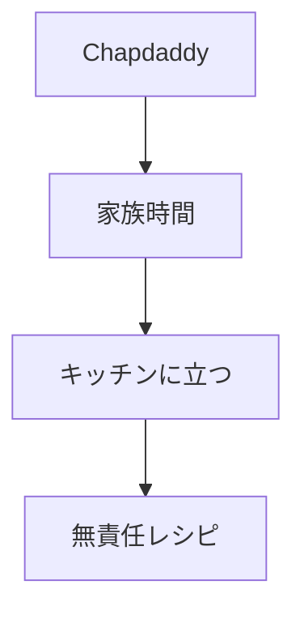

# 作成する。テキスト原稿 無責任レシピとは

## 方針

Chapdaddyの考え方を、料理サイト向けに短く伝える。

## 原稿

### 見出し

無責任レシピとは

### リード

完璧じゃなくていい。

### 本文

無責任レシピは、Chapdaddy代表デザイナー・コヤマの大学ノートに残っていた、秘伝のレシピから生まれた料理サイトです。

きっちり計らなくてもいい。

手順どおりに全部できなくてもいい。

それでも、家族や自分のためにキッチンに立つ時間は、少しだけいい時間になる。

そんな「だいたい旨い」を集めています。

キッチンに立つきっかけを、Chapdaddyと一緒に届けます。

### リンク文言

Chapdaddyの気分が上がる道具を見る

## 短縮版

無責任レシピは、Chapdaddy代表デザイナー・コヤマの大学ノートに残っていた、秘伝のレシピから生まれました。

完璧じゃなくていい。

だいたい旨ければ、それでいい。

キッチンに立つきっかけを、Chapdaddyと一緒に届けます。

## 使い分け

| 種類 | 用途 |
|---|---|
| 原稿 | デザインに余白がある場合 |
| 短縮版 | コンパクトに見せる場合 |
