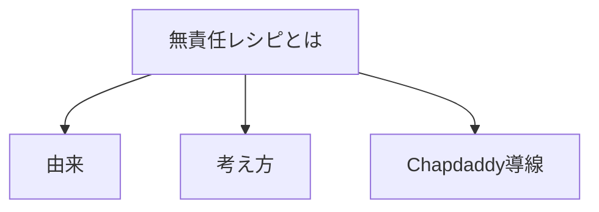
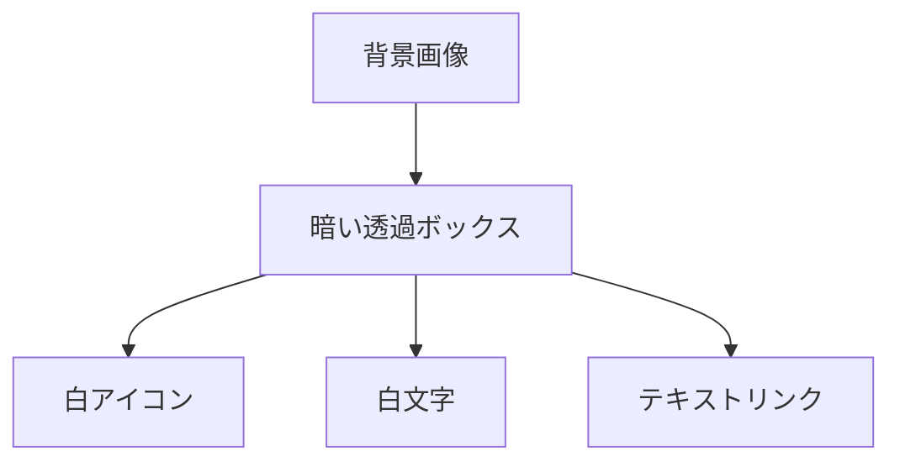

# 要件定義 無責任レシピとは

## 目的

「無責任レシピとは」セクションを作成する。

## 対象

| 対象 | 内容 |
|---|---|
| TOP | `index.html` |
| CSS | `css/about-recipe.css` |
| CSS入口 | `css/style_v2.css` |
| 画像 | `assets/images/about_recipe_note.jpeg` |

## 表示内容

| 要素 | 内容 |
|---|---|
| 背景 | 大学ノート写真 |
| アイコン | 白いChapdaddyアイコン |
| 見出し | `無責任レシピとは` |
| リード | `完璧じゃなくていい。` |
| 本文 | 作成済み原稿を使う |
| リンク | `Chapdaddyの気分が上がる道具を見る` |
| リンク先 | `https://chapdaddy.buyshop.jp/` |

## デザイン

指示画像に合わせる。

## 方針

| 項目 | 内容 |
|---|---|
| CSS | 専用CSSにする |
| 画像 | `assets/images` に複製する |
| 画像サイズ | 必要なら軽量化する |
| リンク | テキストリンクにする |
| アイコン | arrow iconを付ける |

## 対象外

| 対象外 | 内容 |
|---|---|
| 他セクション | 対象外 |
| レシピデータ | 対象外 |
| ECバナー | 対象外 |
| 詳細ページ | 対象外 |
