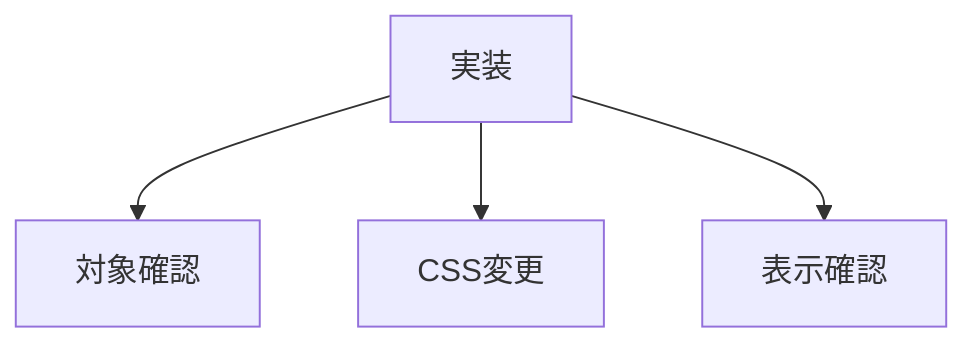

# タスク メイン画像サイズ統一

## 目的

メイン画像を横3:縦4に統一する。

## タスク

| 状態 | 項目 |
|---|---|
| 完了 | 対象ファイルを読み直す |
| 完了 | `.c_home-hero` を3:4にする |
| 完了 | `.c_list-hero` を3:4にする |
| 完了 | `.c_recipe-hero` を3:4にする |
| 完了 | 各画像に `object-fit: cover` を設定する |
| 完了 | TOPをHTTP確認する |
| 完了 | 一覧をHTTP確認する |
| 完了 | 詳細をHTTP確認する |

## 対象ファイル

| 種類 | ファイル |
|---|---|
| CSS | `css/components_v2.css` |
| TOP | `index.html` |
| 一覧 | `list.html` |
| 詳細 | `partials/details/*.html` |

## 確認URL

| 表示 | URL |
|---|---|
| TOP | `http://127.0.0.1:8000/index.html` |
| 一覧 | `http://127.0.0.1:8000/list.html` |
| 詳細 | `http://127.0.0.1:8000/detail.html?id=chicken_nanban` |

## 完了条件

| 条件 | 内容 |
|---|---|
| TOP | メイン画像が3:4 |
| 一覧 | メイン画像が3:4 |
| 詳細 | メイン画像が3:4 |
| 画像 | `cover` で埋まる |
| 表示 | SP幅で破綻しない |
