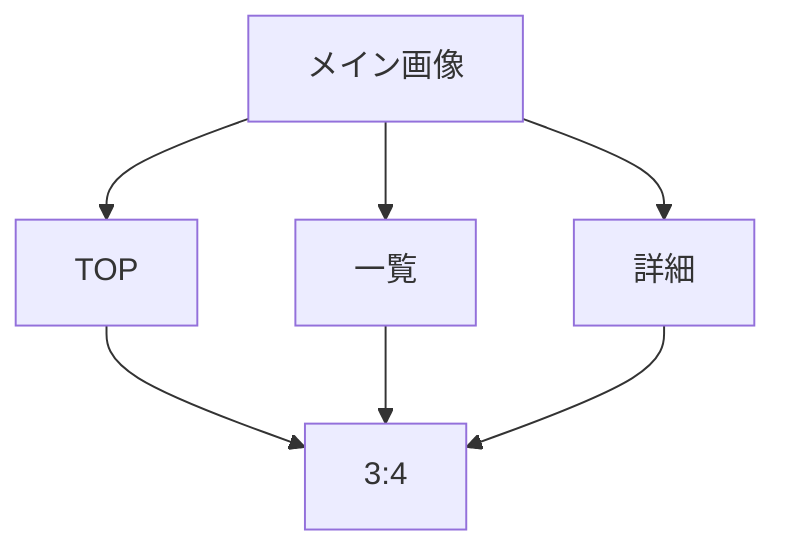
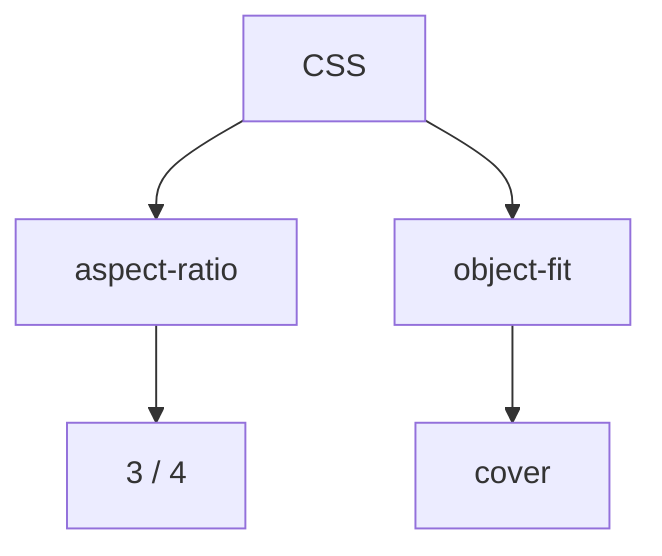

# 要件定義 メイン画像サイズ統一

## 目的

各ページのメイン画像サイズを統一する。

## 対象

| 対象 | 内容 |
|---|---|
| TOP | `c_home-hero` |
| 一覧 | `c_list-hero` |
| 詳細 | `c_recipe-hero` |
| CSS | `css/components_v2.css` |

## 要件

| 項目 | 内容 |
|---|---|
| アスペクト比 | 横3:縦4 |
| 画像 | 既存画像を使う |
| 表示 | `object-fit: cover` で調整する |
| 主対象 | SP表示 |
| 確認 | TOP、一覧、詳細 |

## 方針

CSSで統一する。

## 対象外

| 対象外 | 内容 |
|---|---|
| 画像生成 | 対象外 |
| 画像差し替え | 対象外 |
| 本文変更 | 対象外 |
| ECバナー | 対象外 |
