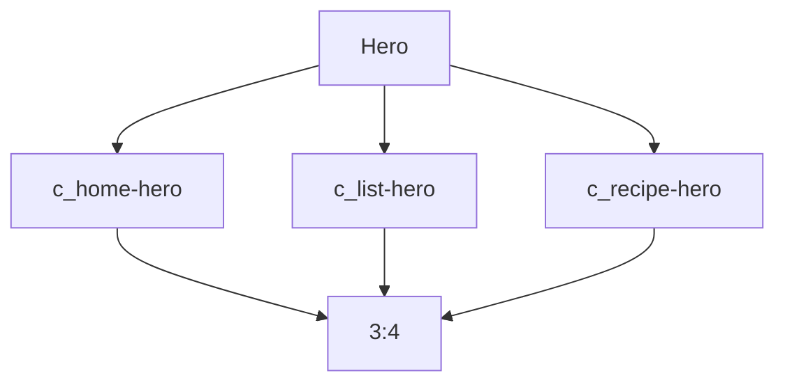
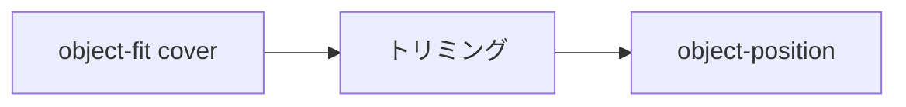

# 設計 メイン画像サイズ統一

## 構成

3種類のヒーロー画像を同じ比率にする。



## CSS

CSSは `css/components_v2.css` に置く。

```css
.c_home-hero,
.c_list-hero,
.c_recipe-hero {
  aspect-ratio: 3 / 4;
  min-height: auto;
}

.c_home-hero__image,
.c_list-hero__image,
.c_recipe-hero__image {
  height: 100%;
  object-fit: cover;
}
```

## 対象クラス

| 種類 | ラッパー | 画像 |
|---|---|---|
| TOP | `.c_home-hero` | `.c_home-hero__image` |
| 一覧 | `.c_list-hero` | `.c_list-hero__image` |
| 詳細 | `.c_recipe-hero` | `.c_recipe-hero__image` |

## 現状

| 種類 | 現状 |
|---|---|
| TOP | `27rem` |
| 一覧 | `22rem` |
| 詳細 | `35rem` |

## 調整

必要なら `object-position` を個別に設定する。



| 対象 | 初期方針 |
|---|---|
| TOP | `center` |
| 一覧 | `center` |
| 詳細 | `center` |

## 注意

| 項目 | 内容 |
|---|---|
| トリミング | 画像の一部が切れる |
| コピー | 画像上の文字と重ならないか確認する |
| 詳細 | 料理が中央に残るか確認する |
| 既存変更 | 勝手に戻さない |
