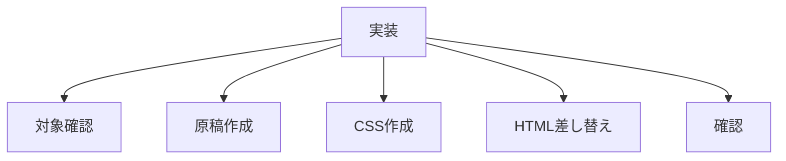

# タスク コヤマの独り言

## 目的

角煮詳細ページで「コヤマの独り言」をテスト実装する。

## タスク

| 状態 | 項目 |
|---|---|
| 完了 | 対象ファイルを読み直す |
| 完了 | 角煮用の原稿を確定する |
| 完了 | `css/recipe-note.css` を作成する |
| 完了 | `css/style_v2.css` にimportを追加する |
| 完了 | `detail_kakuni.html` の「まとめ」を差し替える |
| 完了 | `about_recipe_note.jpeg` 背景を使う |
| 完了 | `detail.html?id=kakuni` をHTTP確認する |

## 対象ファイル

| 種類 | ファイル |
|---|---|
| partial | `partials/details/detail_kakuni.html` |
| CSS | `css/recipe-note.css` |
| CSS入口 | `css/style_v2.css` |
| 背景 | `assets/images/about_recipe_note.jpeg` |

## 確認URL

| 表示 | URL |
|---|---|
| 角煮詳細 | `http://127.0.0.1:8000/detail.html?id=kakuni` |

## 完了条件

| 条件 | 内容 |
|---|---|
| 見出し | `コヤマの独り言` が表示される |
| 本文 | 箇条書きで表示される |
| 背景 | 大学ノート写真が表示される |
| 可読性 | 白文字が読める |
| 範囲 | 角煮だけに反映される |
