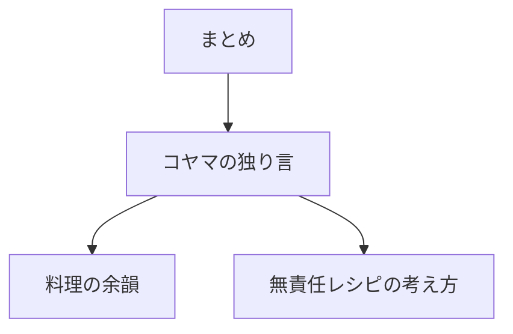

# 要件定義 コヤマの独り言

## 目的

詳細ページの「まとめ」を「コヤマの独り言」にする。

## 対象

| 対象 | 内容 |
|---|---|
| テストページ | `detail.html?id=kakuni` |
| partial | `partials/details/detail_kakuni.html` |
| CSS | `css/recipe-note.css` |
| 背景 | `assets/images/about_recipe_note.jpeg` |

## 表示内容

| 要素 | 内容 |
|---|---|
| 番号 | `05` |
| 見出し | `コヤマの独り言` |
| リード | 角煮への短い一言 |
| 本文 | 箇条書き |
| 背景 | 大学ノート写真 |

## 方針

| 項目 | 内容 |
|---|---|
| テスト範囲 | まず角煮だけ |
| 文体 | 無責任レシピとはの方向性 |
| デザイン | 暗い透過パネルと白文字 |
| 本文形式 | 箇条書き |
| 将来 | 他レシピへ展開できる形 |

## 対象外

| 対象外 | 内容 |
|---|---|
| 他レシピ反映 | 対象外 |
| レシピ手順変更 | 対象外 |
| トップページ変更 | 対象外 |
| 画像新規作成 | 対象外 |
