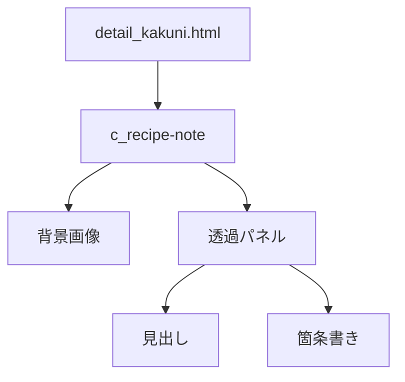
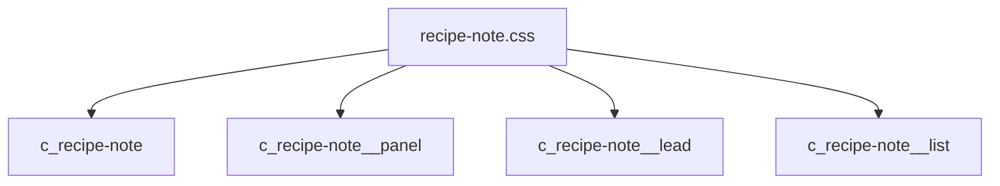
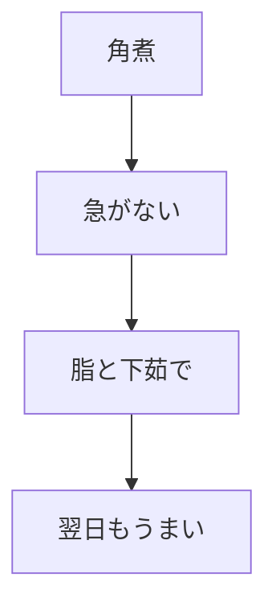

# 設計 コヤマの独り言

## 構成

角煮詳細の「まとめ」を差し替える。



## HTML

`partials/details/detail_kakuni.html` の末尾セクションを差し替える。

```html
<section class="c_recipe-note">
  <div class="c_recipe-note__panel">
    <div class="c_section-head c_section-head--light">
      <span class="c_section-head__number">05</span>
      <h2 class="text-hd-t02">コヤマの独り言</h2>
    </div>
    <p class="c_recipe-note__lead">角煮は、急がない料理です。</p>
    <ul class="c_recipe-note__list">
      <li>脂は悪者じゃない。抜きすぎない。</li>
      <li>弱火で待つ時間も、味のうち。</li>
      <li>翌日の角煮は、だいたい勝ちです。</li>
    </ul>
  </div>
</section>
```

## CSS

CSSは `css/recipe-note.css` に置く。



| クラス | 方針 |
|---|---|
| `c_recipe-note` | 背景画像を持つ |
| `c_recipe-note__panel` | 暗い透過パネル |
| `c_recipe-note__lead` | 短い一言 |
| `c_recipe-note__list` | 白文字の箇条書き |

## CSS入口

`style_v2.css` にimportを追加する。

```css
@import url("./recipe-note.css") layer(components);
```

## 原稿案



| 種類 | 文言 |
|---|---|
| リード | 角煮は、急がない料理です。 |
| 1 | 脂は悪者じゃない。抜きすぎない。 |
| 2 | 弱火で待つ時間も、味のうち。 |
| 3 | 翌日の角煮は、だいたい勝ちです。 |

## 注意

| 項目 | 内容 |
|---|---|
| 可読性 | 白文字が読める濃度にする |
| SP | 箇条書きが詰まらないようにする |
| 共通化 | 他レシピへ流用しやすいクラス名にする |
| 既存変更 | 勝手に戻さない |
