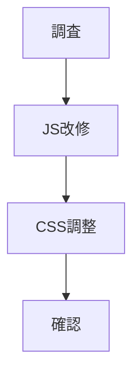
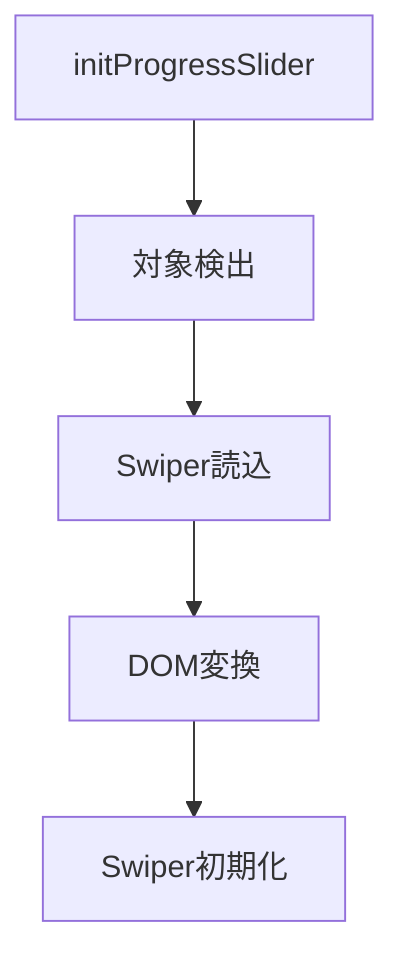
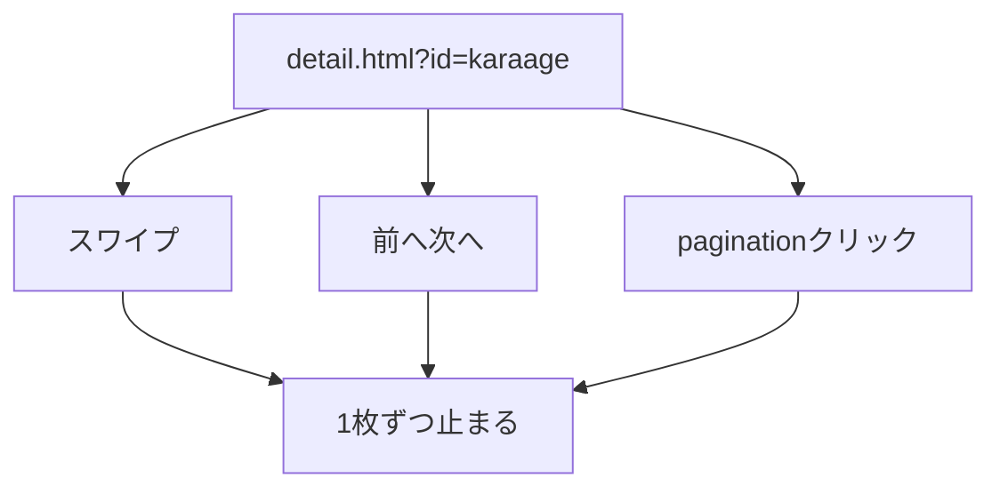

# タスク 詳細ページ作り方Swiper化

## 手順



## タスク

| 状態 | 内容 |
|---|---|
| 完了 | `js/main.js` の現状を読む |
| 完了 | `shop-banner.js` のSwiper読込処理を確認する |
| 完了 | `.c_step-section` 内だけを対象にする |
| 完了 | 既存DOMへSwiperクラスを追加する |
| 完了 | pagination要素を追加する |
| 完了 | navigation要素を追加する |
| 完了 | Swiperを初期化する |
| 完了 | 既存progress処理を整理する |
| 完了 | CSSを調整する |
| 完了 | 詳細7件で作り方構造を確認する |

## JS確認



## CSS確認

| 項目 | 確認 |
|---|---|
| 現在地ナビ | 添付の赤枠に近いバー表示 |
| active | ブランド色で見える |
| 画像 | 既存比率を維持 |
| 本文 | はみ出さない |
| ボタン | 邪魔にならない |

## 動作確認



確認URL。

```text
http://127.0.0.1:8000/detail.html?id=karaage
```

## 検証メモ

| 項目 | 結果 |
|---|---|
| JS構文 | `node --check js/main.js` OK |
| HTTP確認 | `http://127.0.0.1:8001/detail.html?id=karaage` OK |
| Swiper CDN JS | HTTP 200 |
| Swiper CDN CSS | HTTP 200 |
| 詳細構造 | 7件すべて `c_step-section` あり |
| Browser確認 | この環境では `Browser is not available: iab` |

## 確認対象

| ID | レシピ |
|---|---|
| `chicken_nanban` | しっとり甘だれチキン南蛮 |
| `ebi_tofu_manju` | ふわっと海老の豆腐まんじゅう |
| `gyu_buta_don` | 叙々苑風 牛豚丼 |
| `hamburg` | びくどん風ハンバーグ |
| `kakuni` | じっくり煮込む極上豚の角煮 |
| `karaage` | 究極のからあげ |
| `uni_cream_pasta` | 濃厚うにクリームパスタ |

## 完了条件

- 1スライドずつ停止する。
- 現在地ナビが表示される。
- 現在地ナビをクリックできる。
- 前へ・次へで移動できる。
- Swiper読込失敗時に大きく崩れない。
- ECカルーセルが壊れない。
