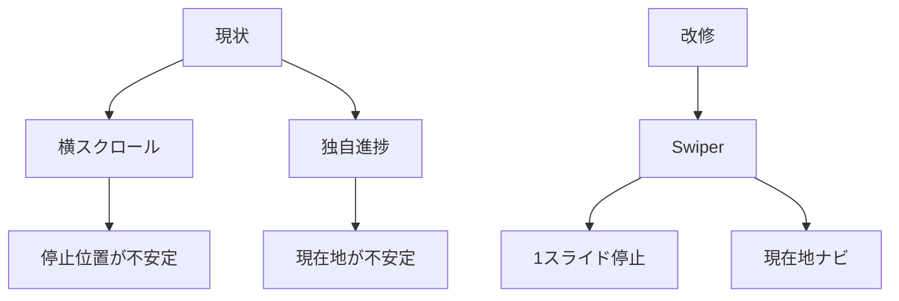
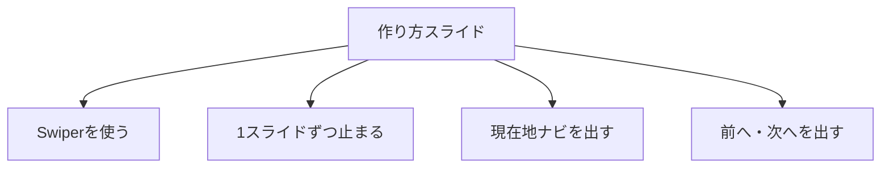
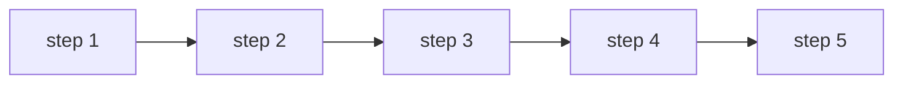
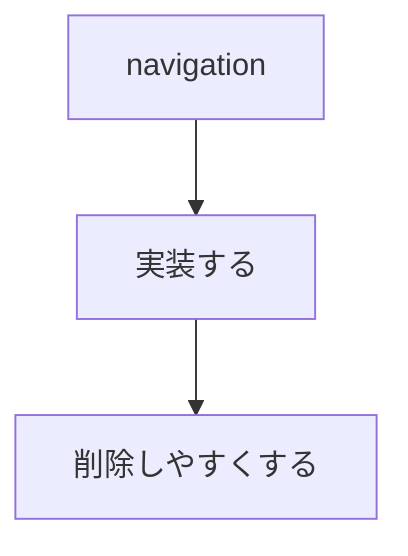

# 要件定義 詳細ページ作り方Swiper化

## 目的

詳細ページの「04 作り方」を操作しやすくする。

## 対象

| 対象 | 内容 |
|---|---|
| ページ | `detail.html?id=...` |
| セクション | `04 作り方` |
| 本文HTML | `partials/details/*.html` |
| JS | `js/main.js` |
| CSS | `css/components_v2.css` または専用CSS |

## 必須要件

| 要件 | 内容 |
|---|---|
| Swiper | ライブラリ機能を使う |
| 停止 | 1スライド単位で停止する |
| 現在地 | Swiper paginationを使う |
| 操作 | Swiper navigationを使う |
| 自動再生 | 使わない |
| ループ | 使わない |

## 現在地ナビ

添付指示の赤枠部分。

Swiperの `pagination` をバー型に見せる。

クリック可能にする。

## 前へ・次へ

前へ・次へボタンは必要。

後で削除する可能性がある。

## 対象外

| 対象外 | 理由 |
|---|---|
| レシピ本文の書き換え | 操作性改善が目的 |
| autoplay | 手順確認に不要 |
| loop | 手順の終点を明確にする |
| ECカルーセル改修 | 別機能 |

## 参照

| 資料 | 用途 |
|---|---|
| `_docs/Swiperドキュメン関連.md` | Swiper公式資料 |
| `_worklogs/2026-06-15_03-51_下部ECカルーセル/設計_下部ECカルーセル.md` | 既存Swiper利用方針 |
| `_docs/設計_共通.md` | CSS配置方針 |
