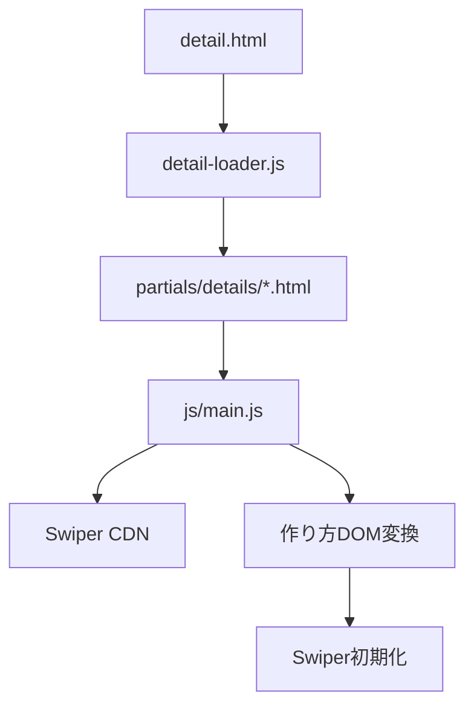
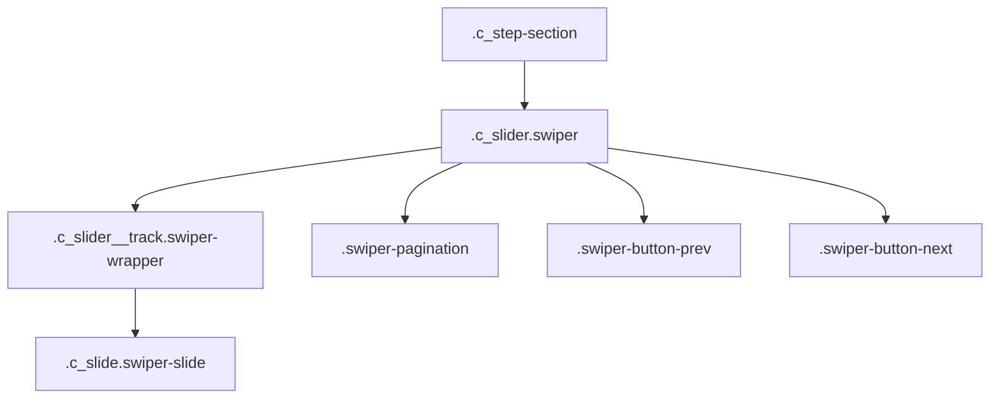
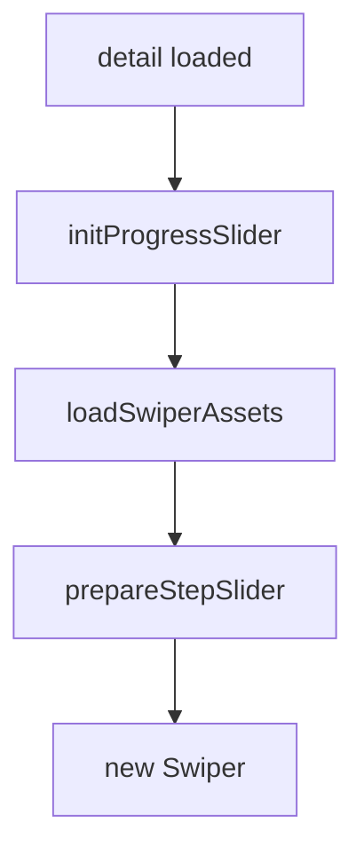
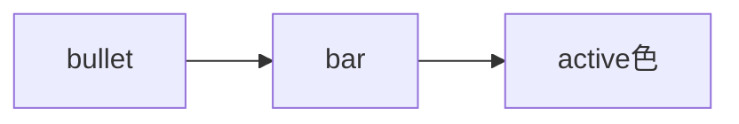
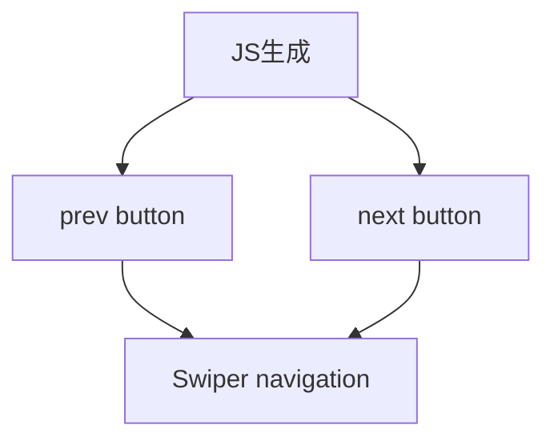
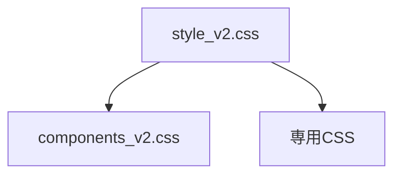

# 設計 詳細ページ作り方Swiper化

## 構成



## 基本方針

既存の詳細HTMLを大きく変更しない。

`js/main.js` で既存DOMをSwiper構造へ変換する。


## Swiper構造



| 既存 | 追加 |
|---|---|
| `.c_slider` | `.swiper` |
| `.c_slider__track` | `.swiper-wrapper` |
| `.c_slide` | `.swiper-slide` |
| `.c_progress` | Swiper paginationへ置換または非表示 |

## 初期化



| 設定 | 値 |
|---|---|
| `slidesPerView` | `1` |
| `spaceBetween` | `0` |
| `loop` | `false` |
| `autoplay` | `false` |
| `pagination.clickable` | `true` |
| `navigation` | `true` |

## 現在地ナビ

Swiperの `pagination` を使う。

バー型にCSS調整する。



## 前へ・次へ

Swiperの `navigation` を使う。

削除しやすいように、JS生成に寄せる。



## Swiper読込

既存の `shop-banner.js` と同じCDNを使う。

```text
https://cdn.jsdelivr.net/npm/swiper@12/swiper-bundle.min.css
https://cdn.jsdelivr.net/npm/swiper@12/swiper-bundle.min.js
```

重複読み込みは避ける。

既存ID `swiper-css` と `swiper-js` を利用する。

## CSS配置



| 案 | 評価 |
|---|---|
| `components_v2.css` に追記 | 既存スライダーCSSがある |
| `recipe-steps.css` を追加 | 分離しやすい |

実装時は差分量で判断する。

## エラー時

| 状態 | 対応 |
|---|---|
| Swiper読込失敗 | 既存横スクロールを残す |
| スライドなし | 初期化しない |
| 詳細HTML未読込 | 初期化しない |

## 注意

- `id="slider"` は複数化に弱い。
- 対象は `.c_step-section` 内に限定する。
- `DOMContentLoaded` と `recipe-detail:loaded` の二重初期化を避ける。
- 既存のECカルーセルSwiperを壊さない。
