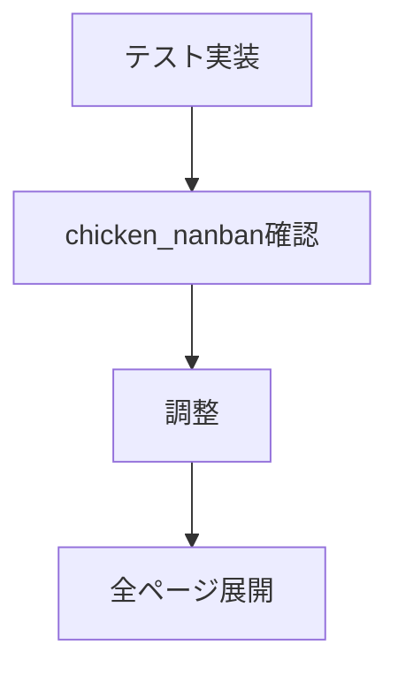
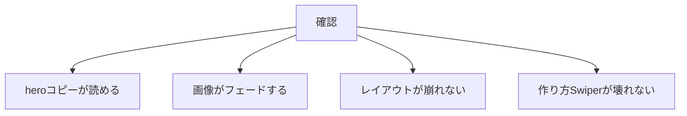

# タスク 詳細ページメイン画像フェード

## 手順



## タスク

| 状態 | 内容 |
|---|---|
| 完了 | `detail_chicken_nanban.html` のheroと作り方画像を確認する |
| 完了 | `detail_chicken_nanban.html` にheroフェード画像を追加する |
| 完了 | 初回は `chicken_nanban` のみ有効にする |
| 完了 | `css/components_v2.css` にheroフェードCSSを追加する |
| 完了 | JS生成方式をやめてHTML/CSS方式へ整理する |
| 完了 | reduced motion対応を入れる |
| 完了 | `detail.html?id=chicken_nanban` で確認する |
| 完了 | 問題なければ全詳細ページへ広げる |

## 確認項目



| 項目 | 確認 |
|---|---|
| 初期表示 | hero画像が表示される |
| フェード | 画像が自然に切り替わる |
| コピー | タイトルが読める |
| スマホ | 画像比率が崩れない |
| 作り方 | Swiperがそのまま動く |

## 確認URL

```text
http://127.0.0.1:8001/detail.html?id=chicken_nanban
```

## 検証メモ

| 項目 | 結果 |
|---|---|
| HTTP確認 | `detail.html?id=chicken_nanban` 200 |
| HTML確認 | `detail_chicken_nanban.html` にフェード画像を明示 |
| CSS確認 | `hero-fade-cycle` で自動切替 |
| 対象画像 | hero 1枚 + 作り方5枚 |
| 初回範囲 | `chicken_nanban` のみ |
| 実装方式 | HTMLに画像を明示しCSS animationで切替 |
| 展開 | 全詳細ページへ展開済み |

## 完了条件

- `chicken_nanban` でフェード表示できる。
- heroコピーが読みやすい。
- 作り方Swiperが壊れない。
- reduced motionで静止する。
- 全ページ展開の判断ができる。
