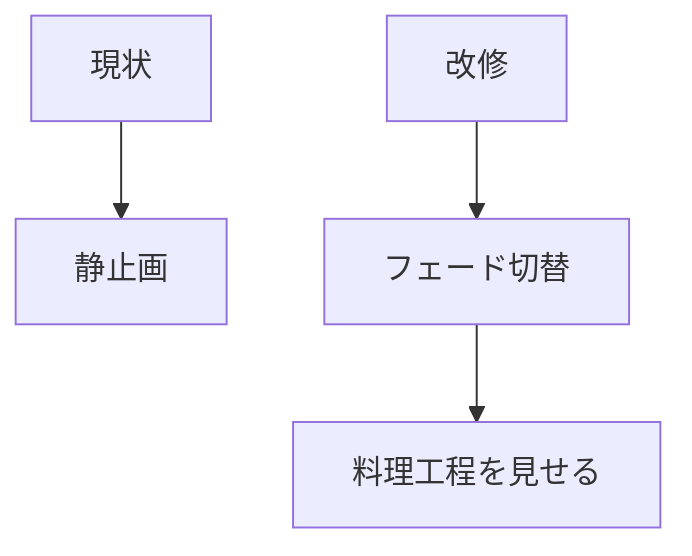
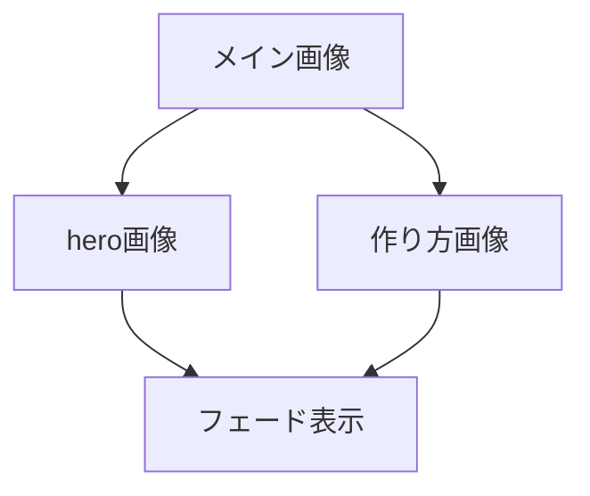
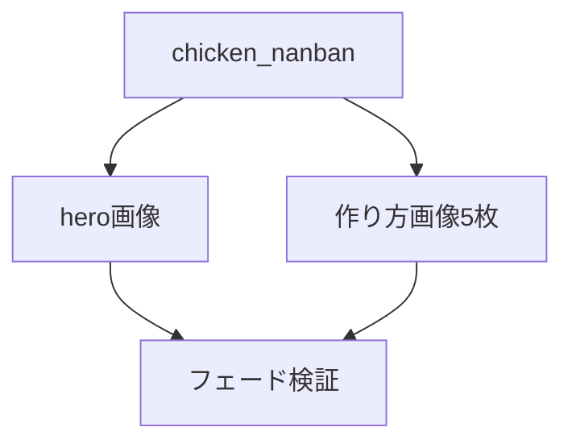

# 要件定義 詳細ページメイン画像フェード

## 目的

詳細ページのメイン画像に動きを出す。

## 対象

| 区分 | 内容 |
|---|---|
| 最終対象 | 全詳細ページ |
| 初回対象 | `detail_chicken_nanban.html` |
| 対象要素 | `.c_recipe-hero__image` |
| 画像元 | `.c_slide__image` |

## 必須要件

| 要件 | 内容 |
|---|---|
| 画像切替 | フェードイン・フェードアウト |
| 画像元 | ヒーロー画像 + 作り方画像 |
| UI | 追加しない |
| ライブラリ | 使わない |
| 表示 | 既存ヒーローの見た目を維持 |
| motion配慮 | `prefers-reduced-motion` では停止 |

## 初回検証

`detail_chicken_nanban.html` だけで確認する。

問題なければ全詳細ページへ展開する。

## 対象外

| 対象外 | 理由 |
|---|---|
| Swiper | 操作用スライドではない |
| pagination | 画像演出なので不要 |
| navigation | 画像演出なので不要 |
| レシピ本文変更 | 表示演出が目的 |

## 推奨値

| 項目 | 値 |
|---|---|
| 切替間隔 | 3秒 |
| フェード時間 | 1秒 |
| 開始画像 | 既存hero画像 |
