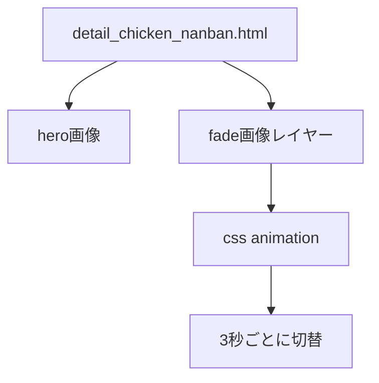
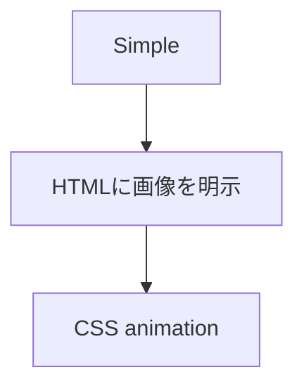
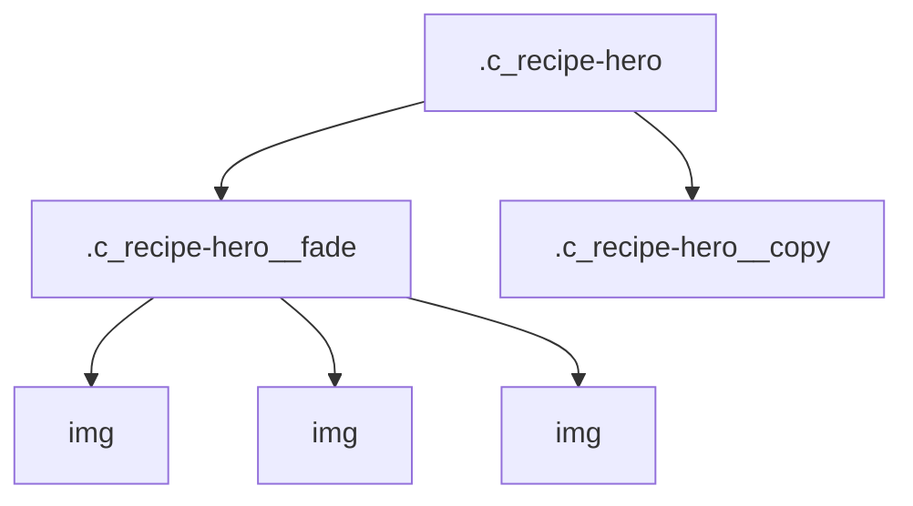
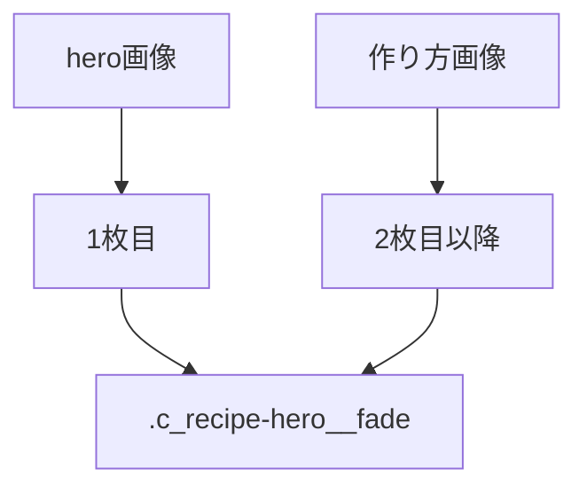
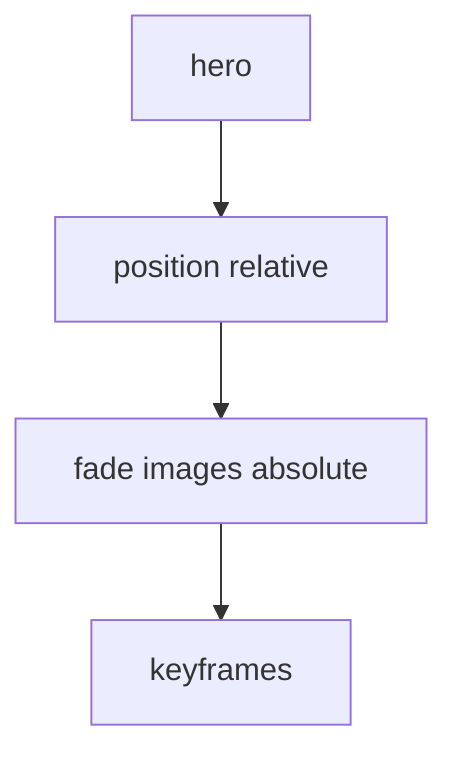
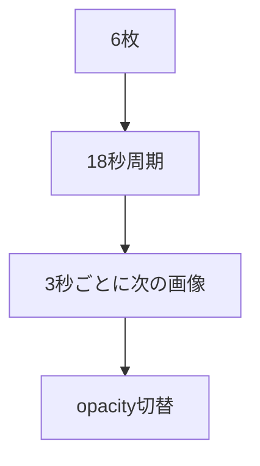
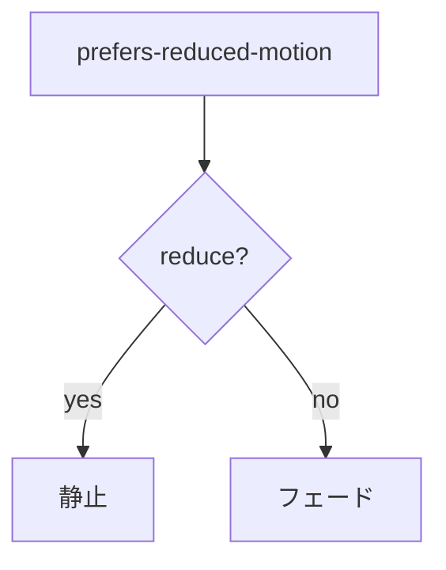
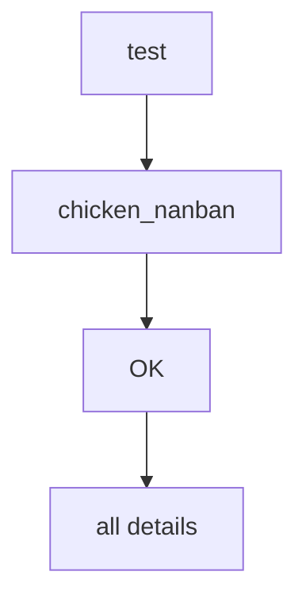

# 設計 詳細ページメイン画像フェード

## 構成

## 基本方針

Swiperは使わない。

HTMLとCSSだけで実装する。

## DOM方針

既存の `.c_recipe-hero__image` を残す。

HTMLにフェード用のラッパーを明示する。

## 画像配置

初回検証では `detail_chicken_nanban.html` に画像を直接書く。

## CSS

| class | 役割 |
|---|---|
| `.c_recipe-hero__fade` | 画像レイヤーの親 |
| `.c_recipe-hero__fade-image` | フェード対象 |
| `.c_recipe-hero__fade--auto` | 自動切替 |

## Animation

| 項目 | 値 |
|---|---|
| 枚数 | 6枚 |
| 周期 | 18秒 |
| 間隔 | 3秒 |
| 表示 | `opacity: 0.82` |

## reduced motion

## 初回制限

初回は `chicken_nanban` のみ有効化する。

実装確認後、全詳細ページへ広げる。

## 注意

- 既存heroコピーを隠さない。
- フェード用画像は `aria-hidden="true"` にする。
- JS初期化に依存しない。
- 全ページ展開時は各詳細HTMLに同じ構造を追加する。
