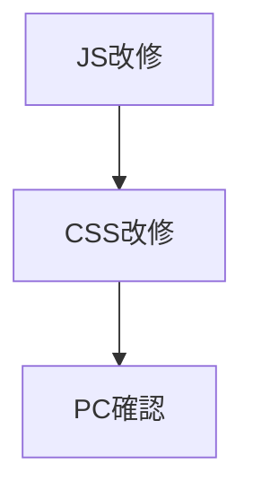
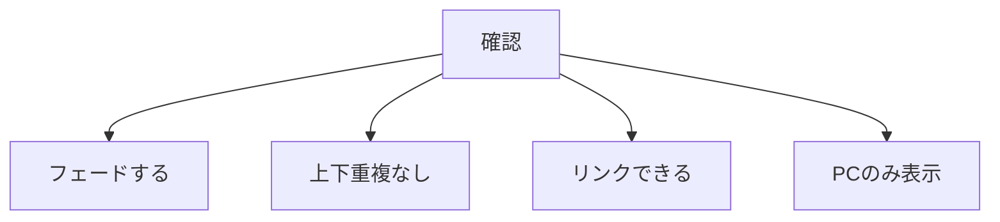

# タスク PC左右バナーフェード

## 手順



## タスク

| 状態 | 内容 |
|---|---|
| 完了 | `js/shop-side-banners.js` の現状を読む |
| 完了 | 商品選択を上下重複なしに変更する |
| 完了 | 1枠に複数商品リンクを生成する |
| 完了 | `css/side-banners.css` にフェードCSSを追加する |
| 完了 | reduced motion対応を入れる |
| 完了 | 全枠を4件に揃えて周期を統一する |
| 完了 | 補充時の同枠重複と同タイミング重複を避ける |
| 完了 | PC幅で左右バナーを確認する |
| 完了 | 上下が同じ商品にならないことを確認する |

## 確認項目



| 項目 | 確認 |
|---|---|
| APRON | 上下が違う |
| TABLE | 上下が違う |
| フェード | 6秒ごとに切替 |
| リンク | 商品ページへ遷移 |
| スマホ | 非表示 |

## 確認URL

```text
http://127.0.0.1:8001/detail.html?id=karaage
```

## 完了条件

- PC左右バナーがフェード切替する。
- 上下に同じ商品が出ない。
- 商品リンクが維持される。
- 既存の詳細ページ表示を壊さない。
